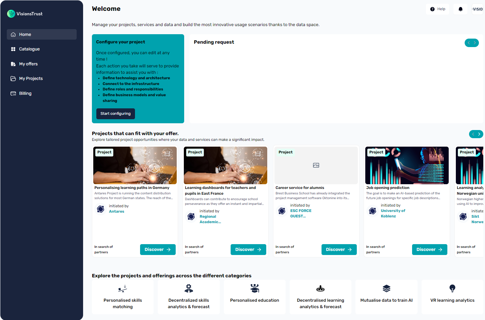

# Dashboard

Your dashboard is the center of operations for most actions you can do in the catalogue. It provides you with quick access to many different actions including:

- Configuring your existing projects
- Discovering offers & projects that match with your existing resources
- Quick access to filtered [catalogue](../application/discovery/index.md) views
- Easy access to managing your projects & offers

## Pending Requests

The pending requests section will display incoming requests that you received in order to join a specific project. Usually, you'll also receive a mail and be able to view this request in the notifications, but to make things simpler, it will also be displayed in a very visual way as soon as you open your dashboard if you have any.

## Matching recommendations

The recommendations section displays projects that can match with existing offers you have registered on the catalogue. The way it matches is by analyzing the category of your offer and finds matching projects that look for offers of your category.

The way the cards work is the same as in the [catalogue](../application/discovery/index.md), selecting Discover will open a side-drawer where you can view more information and also make your requests to join that specific project if you desire.

## Quick Access to the catalogue

The dashboard allows you to quickly access the [catalogue](../application/discovery/index.md) in a pre-defined filtered view. By clicking on one of the categories available, it will open up the [catalogue](../application/discovery/index.md) to match all resources that fit with the selected category.

## Where to go from here

- [Create a data offer](./registering-resources/data.md)
- [Create a service offer](./registering-resources/services.md)
- [Create a project](./projects/creating-a-project.md)
- [Join a project](./projects/join-requests.md)