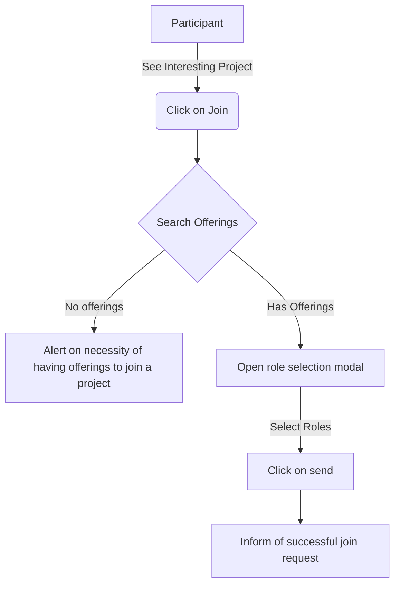

# Join Requests

A project join request is a way for a participant to formulate his interest in a project.

The join request is what enables the participant to send a notification to the project orchestrator in order for the him to review the request and start a negotiation process.

## Formulating a join request

When formulating a join request, it is mandatory for the participant to have published offers that can be used by the project.

> It is not possible to join a project without providing anything to it.

## Flowchart for join request

Below is a simple flow chart showing how it works when a join request is formulated.

## What to do after a join request is sent

Once a join request has been sent, it is up to the orchestrator to review it and chose whether or not to accept it and enter a negotiation process with you to decide which offers would be added as contributions to the project.

The orchestrator will receive in-app notifications as well as an email notification to review the join request.

When the orchestrator validates the join requests and makes his proposal, the [negotiation process](./negotiation.md) is started.
