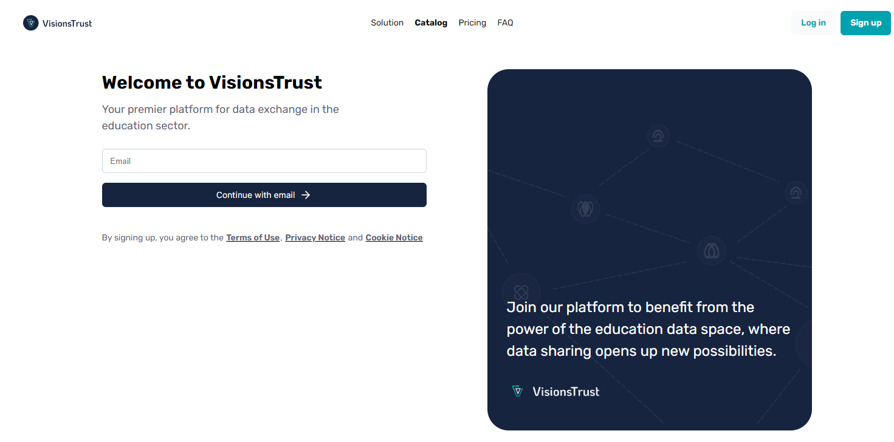
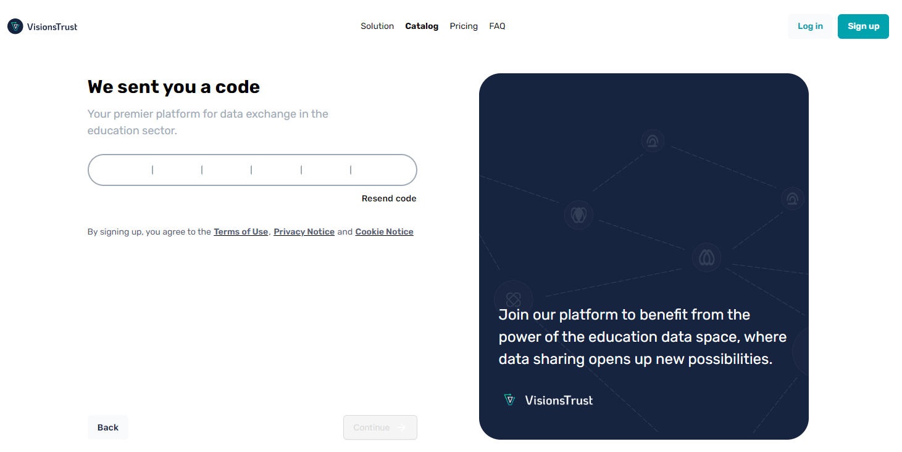
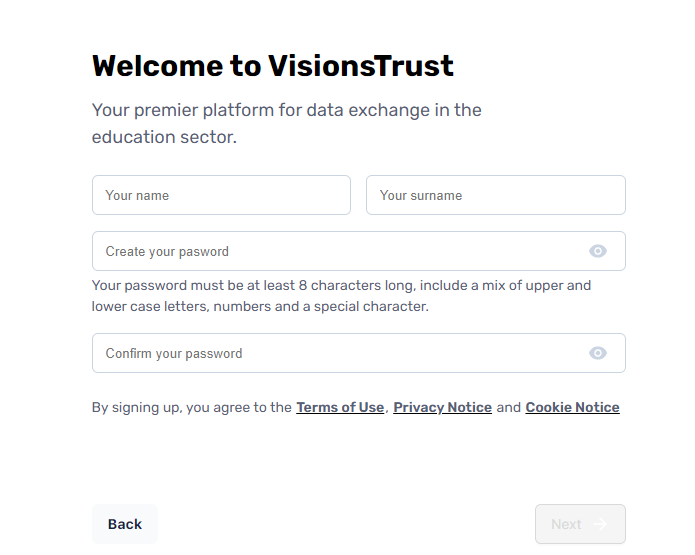
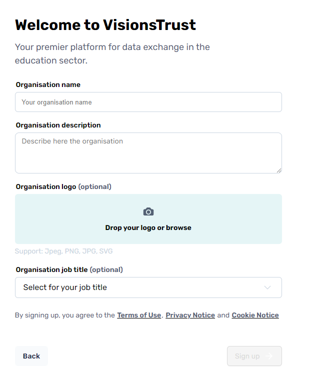

# Onboarding

> Throughout this guide, keep in mind that you can access the [glossary](../glossary.md) at any time if you are unsure of a dataspace related term.

The first step to being able to represent your organisation in the dataspace is by becoming a **Participant** of said dataspace.

VisionsTrust enables you to onboard your organization as a **dataspace participant** through signing up on the VisionsTrust catalogue.

## Signing up on VisionsTrust

Through the sign up button available from VisionsTrust's landing page, you will be prompted to enter your organization's information in order to become a **participant**.

Here are the different steps for signing up and what they represent.

### Step 1: Registering and verifying your email
The first step is registering your email in order for us to send you a verification code that you will receive and need to provide in step 2.

### Step 2: Code verification
Check your inbox! We will have sent you a verification code at the email you provided in step 1 for you to copy and paste or manually enter in this second step. This will validate your email and set you up for the rest of the registration.

If you don't see the email, please ensure you check your spam folder as well. If that doesn't solve it, you can always click on the resend code button to receive another email.

### Step 3: Your personal account information
This next step will ask you to inform account information about yourself as a person. Providing a first name & last name will enable others to know how to contact you when interacting with your organization on the catalogue.

You will also need to setup your password that you will use on subsequent logins to the application. You can change that password anytime in your profile settings later on.

### Step 4: Organization Information
The last step is important as it is where you will be defining the baseline information for your organization which will act as a participant in the ecosystem. The name, description & logo you define here are what will be seen by others when browsing the catalogue for available organizations and when browsing assets and offerings that you provide.

Once this information is set, click on sign up and you'll be ready to start using the application !

## First Login
On your first login, you will be shown an onboarding screen with some information about the application to introduce you to the different subjects. It will ask you a couple questions and then redirect you, depending on your answers, to the creation of a project or creation of a resource.

If you want to discover at your own pace, you can also skip this onboarding screen.

## Next Steps

Whether you followed the onboarding or decided to go at your own pace, it is likely that you will be wanting to do one of three possible actions:

- [Browsing the catalogue](./discovery/index.md)
- [Register data](./registering-resources/data.md)
- [Register services](./registering-resources/services.md)
- [Create a project](./projects/overview.md)