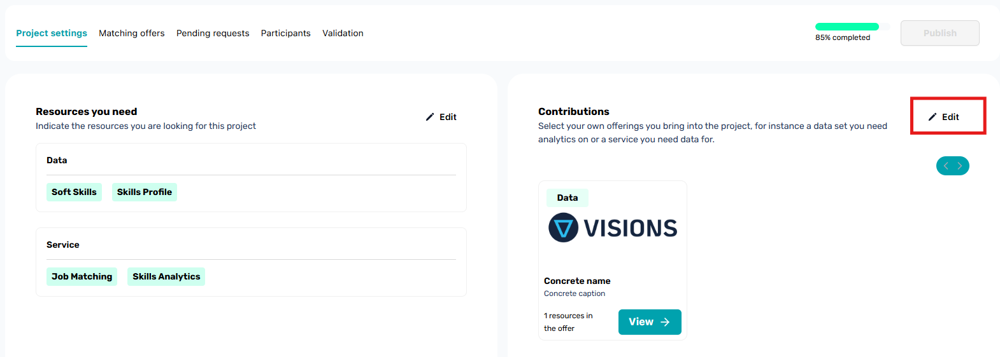
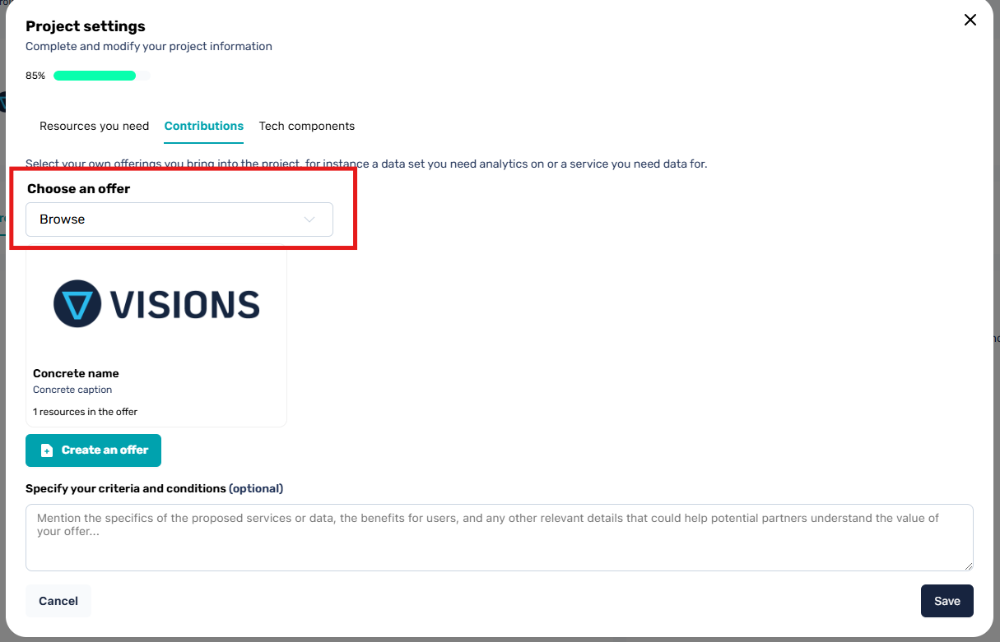
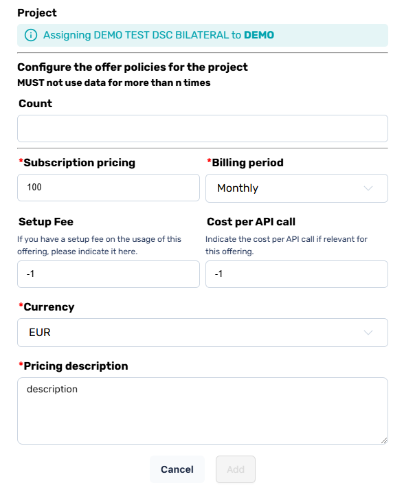

# Adding your own offers to a Project as orchestrator

When you are orchestrator of a project and still wish to run data exchanges with offers you own. It is _mandatory_ to add these offers to the project, otherwise, the contract will not hold information regarding these offers and the connectors will not be able to use said offers in data sharing processes.

Adding an offer to your own project is called a **contribution**.

## Adding contributions

From your project settings, select the _Edit_ button in the _contributions_ section.

Then browse for the offer you want to add to the project

And finally configure the offer with the policies & pricing that apply to that project before adding it to the project.

Once added, the offer will become part of the Project and be included in the Project Contract agreement.