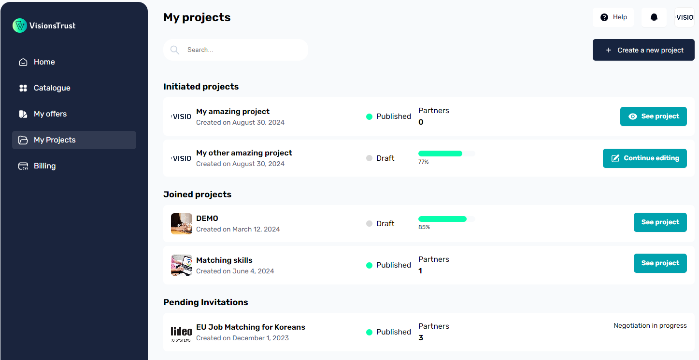
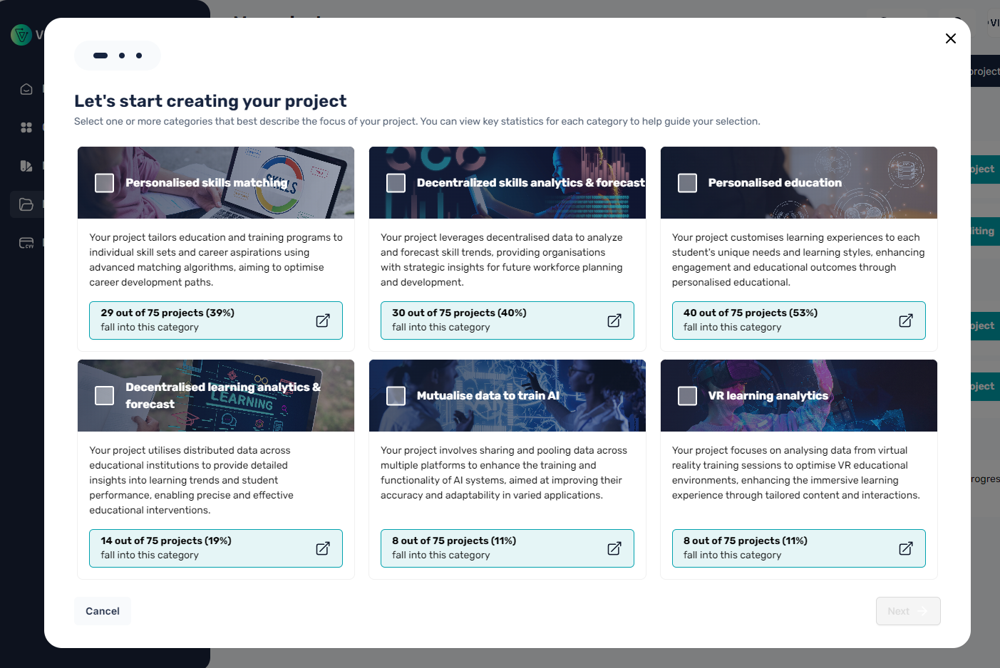
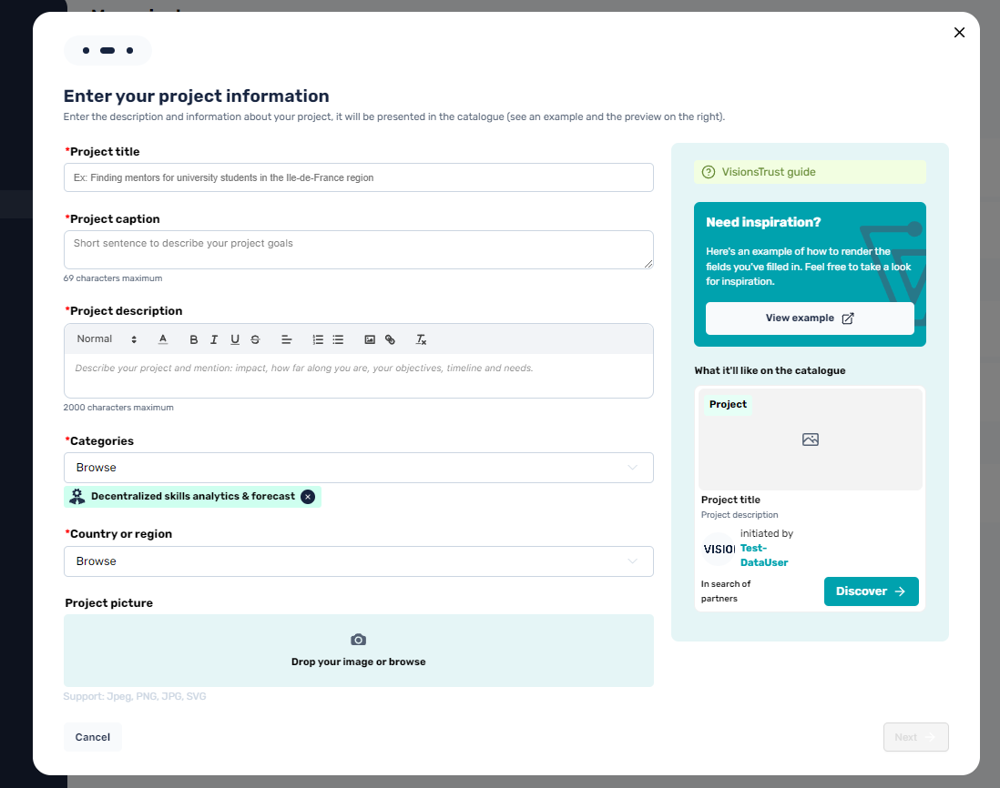
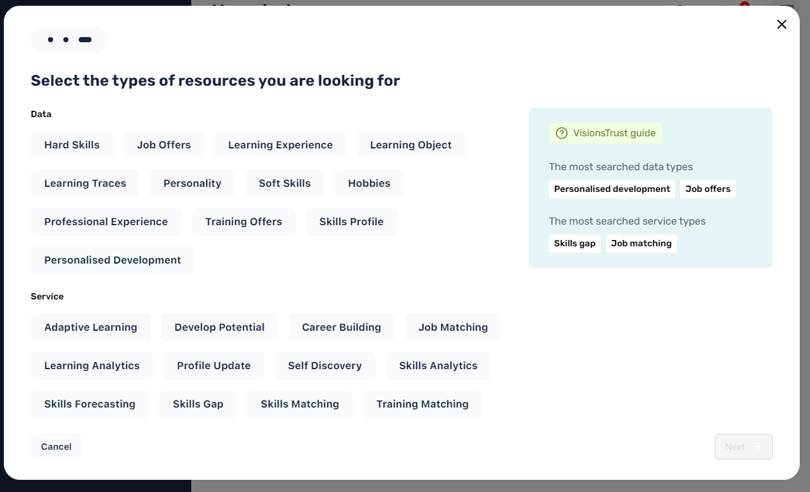

# Creating a Project

There are multiple ways to start creating a project, the easiest of which being by going to "My Projects" available in the navigation sidebar, which will take you to the page displaying all your existing projects and the necessary action buttons to start creating a new project.

## Starting the creation of your project
On the My Projects page, there is a button at the top right of the page to start creating your project. This will open a dialog modal guiding you to register the essential starter information for your project.

### Category selection
The first step in project creation is defining what category this project fits into. This is useful for multiple reasons:

- Being able to find your project in the catalogue when filtering by category
- Enabling recommendations of offers & participants based on the defined category

### General Information registration
Once the categories have been selected, you will be prompted to enter the basic information for your project, such as its name, caption for the catalogue, description, location and setting an optional image for display in the catalogue.

If you don't set an image for your project, your logo will be used instead, and if that is not set as well, a default image based on the categories selected will be displayed.

#### Searched data & services
The last step in project creation is selecting what kind of data and/or services your project is in need for. As for the category selection, this is essential for the same reasons:

- Categorizing your project in the right filters
- Making sure you get recommended offers that are of the searched data / service categories
- Making sure your project gets recommended to participants that provide offers of what your project is in search for

Once all the information has been set, you can create your project and move on to [managing your project](./project-settings.md).