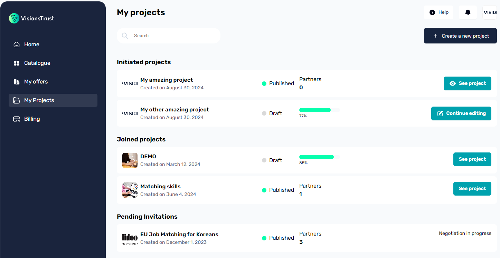

# Projects

> Find the definition of a project in the [glossary](../../glossary.md).

## For Orchestrators
If you have a project in mind to connect data sources to services for defined purposes, projects are the way to go.

Projects enable you to setup a space for enabling your use cases. You will be able to define which participants should be members of the use case, what the project needs to get some recommendations and setup a project contract to regulate the data exchanges that operate under the context of this project.

You can get started with a new project by reading on [how to create a project](./creating-a-project.md).

## For Providers
As a provider of data or services, you might be interested in joining projects that could fit the usage of your services and provide you with interesting value.

### Recommendations
After registering resources and offers as a Provider in the catalogue, project recommendations will start appearing on your [dashboard](../dashboard.md) on which you will be able to easily discover details about these projects and make join requests to them if they are indeed interesting for you.
