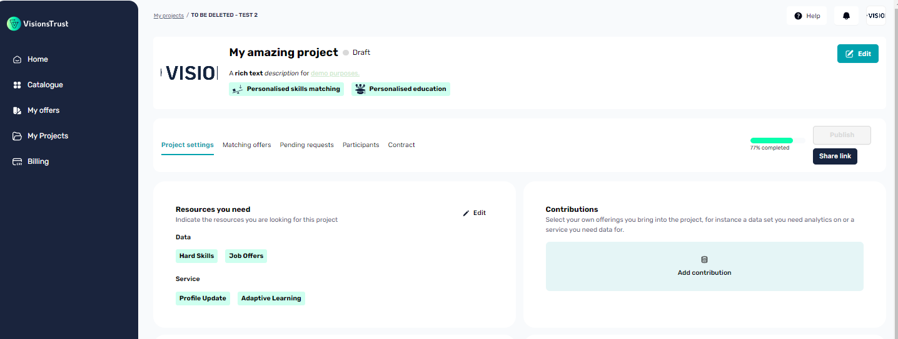

# Project Settings

After successfully [creating a project](./creating-a-project.md), it can be managed and configured in more detail than just the initial required elements.

## Understanding project publication

Configuring your project fully allows you to publish it and make it available to the catalogue. While in draft, even though you will be able to receive recommendations for offers, you will not be able to invite them to your project nor will them be able to find your project in the catalogue or in their recommendations.

**A draft project:**

- Is not available to the catalogue
- Is not recommended to other participants
- Cannot invite offers or participants to join it

**A published project:**

- Is available on the catalogue
- Can be searched in the catalogue
- Is recommended to participants that have matching offers
- Can invite offers / participants to join it
- Can receive join requests from participants that want to join

### Project Subscription

VisionsTrust operates under a pricing model in which you manage a paid subscription per project. This section will not go too much in these details as when you attempt to publish a project, the platform will guide you through understanding how to activate a subscription in order to make your project published.

## Updating information set during creation

When creating the project, you defined a series of information to create the first draft version of the project. All of this information is editable from the Project Settings tab.

## Completing new information

Additionnal information is required before reaching the completion step for your project such as:

- **Defining Tech requirements**: Tech components that your project will use for regulating data exchanges in the project. Some are mandatory and will be set for you by default.
- **Contributions**: Contributions that you **can** add to the project, as in data or services that you would like to the contribute to the project for them to be used by the other participants in the project.

## Project Contract

Upon creating a project, whether it is in a draft or published state, a contract for the project will be generated in a unsigned state.

On the contract tab, the information displayed will be all of the formatted relevant information that concerns your project and what the project provides.

In order to invite participants and ensure data exchanges are authorized, all participants, including you as the orchestrator, should sign this contract by clicking on the Agree / Sign button on this contract tab.
