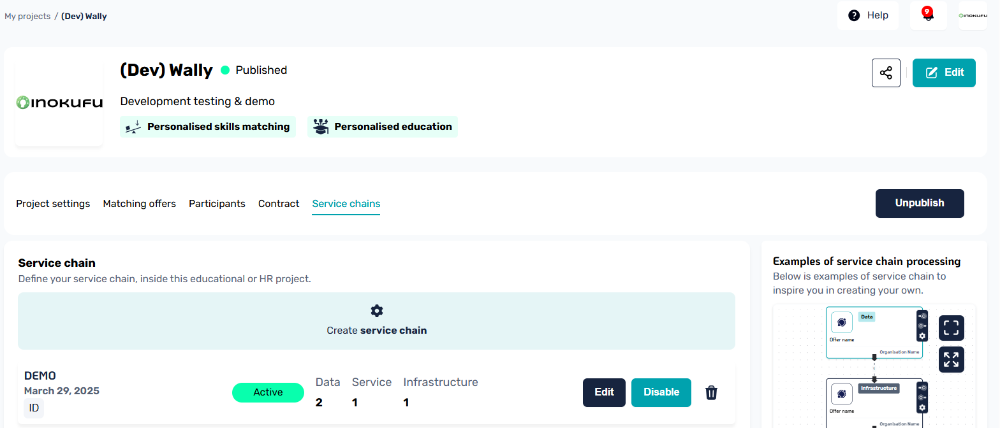
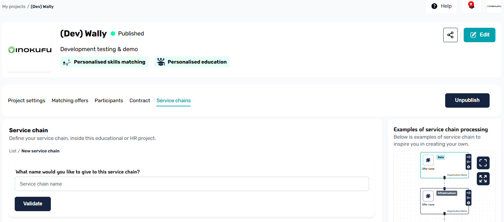
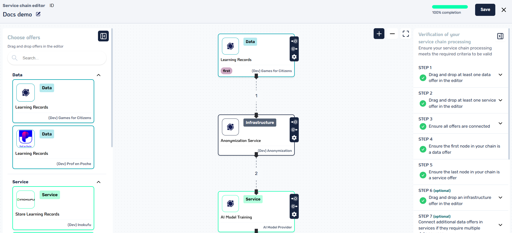
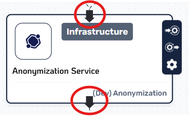
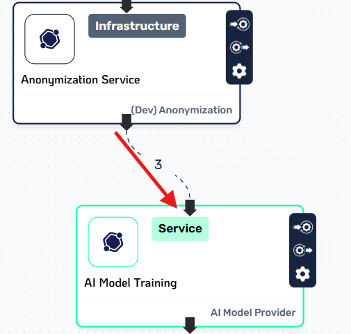
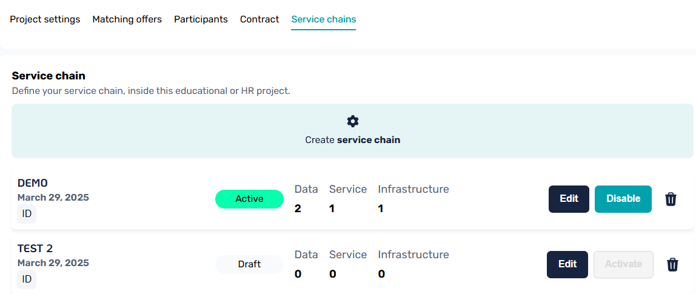
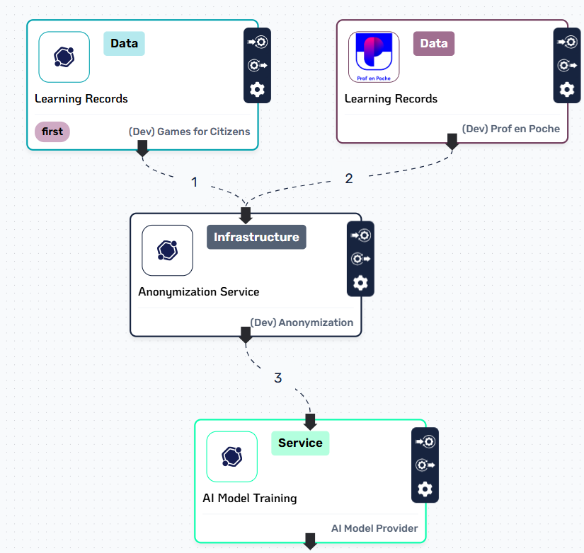

# Service Chains

Service chains are sequences of data transfers between participants, made possible through the use of multi-party ecosystem contracts and the integration of Prometheus-X's [Data Processing Chain Protocol library](https://github.com/prometheus-x-association/data-processing-chain-protocol) directly within the PDC.

VisionsTrust provides the UI that helps you create these service chains within your project through a visual editor that makes it quick and easy to prototype and build sequences of data flows between the available offers in your project.

## Prerequisites

In order to create a service chain, you *need* to have a signed project contract which includes you as a participant and a minimum of one additionnal signed participant providing at least one offer. Essentially, you need to ensure you fit the following conditions:

- You have joined or are orchestrating a [project](./creating-a-project.md).
- The project has **AT LEAST** one Data related offer **AND** one Service related offer.
- All the parties providing these services have signed the project agreement.

!!! warning "Important"

    It is not possible to build a chain with offerings from a participant that has not signed the agreement yet.

## Building the chain

Let's start with the essentials:

* A Service Chain can only be built and defined by the orchestrator of a project
* Multiple different service chains can be activated and used within a single project
* Only offers from participants that signed the project agreement are available when building chains.

### Creating your first chain

Assuming you have completed and ensured all previous steps, go to your project settings page and follow these instructions

1. Go to the service chain tab and click on the Create service chain button

2. Give a name to your service chain to be able to identify it later and validate

3. This will open up the visual editor, you're ready to hop on to the next step. 

### Understanding the visual editor

The service chain can be a little overwhelming at first, so let's go over everything it has to offer.

#### Chain Builder (Center)

The center panel is where you'll be spending most of your time when creating the chain, this is where you will drag offers around and connect them together to form the sequences. This is also where you will be able to identify details about the offers themselves along with their configuration within the chain.

From this pane you have some controls available on mouse click at the top right to zoom in / zoom out or set the view to fit your chain.

#### Offers Panel (Left)

On the left is your selection panel. This is where all of the available offers that can be used within service chains will be located.

!!! question "An offer from my project does not show up"

    If you have an offer in your project that does not show up in this panel, it probably means the provider of this offer has not yet agreed to the project agreement.

From this panel, you can easily find the available data / service / infrastructure offers that you can use to build out your chain. Adding an offer to the chain is as simple as dragging the offer from this panel to the center panel, which will automatically add an instance of that service to the chain.

!!! question "What are offer instances in the builder?"

    We mention *instance* here because in some use cases, some services are used more than once, the chain builder allows you to drag additionnal instances of the same offer to use at different steps of the chain.

#### Validation Panel (Right)

The validation panel is important as it lays out every rule your service chain needs to fit before becoming valid. It updates dynamically with each action that you make in the Chain Builder and works in correlation with the progress bar you can see in the top right.

Each step contains additionnal details when you click on them helping you understand what is expected by each of these rules.

!!! info

    Although you can save a work in progress service chain, you will not be able to activate it if it doesn't comply to all the validation rules.

#### Connecting offers together

If this is your first time using a node-based editor tool, we've got you covered. We tried making it simple to visualize where actions can be done in the editor.

If you take a look at how one offer is visually represented in the chain, you will generally see two arrows. One going in the offer at the top, and one going out at the bottom. This is where you will be clicking and dragging to create the edges that should be plugged in to the next offer.

!!! question "Why do data offers have no input?"

    Data based offers have no input as they are seen as simple data sources in the protocol. If you have an offer that requires some input, then that probably means that you should rather be making a service based offer instead.

Connecting offers together is then very simple, simply drag from the out-facing arrow of one offer directly to the input of the offer you want to have after it.

And voilà! Your offers are connected and form a part of a service chain. Plug in the rest of your offers following the same principle and your chain should be ready in no time.

#### Saving the chain

At the top right of the editor is the save button. This action can be done at any time, even if your chain is still a work in progress. When saving, it will register your current configuration, connections and positions of your nodes allowing you to come back to it later to complete it if you need to.

Once your chain is complete and you save it, you then have the option to [activate it](#activating-a-chain).

## Activating A Chain

If your service chain fits all the validation rules and is properly saved, you will be able to view it in the list of service chains of your project under the `service chains` tab.

From here, you can do a couple of things:

* Edit your chain, which will take you back to the chain builder
* Activate your chain if it is validated
* Disable an active chain
* Delete your service chain

In the example above, you can see two different scenarios, in the first one the "DEMO" chain is active, meaning that it has passed the validation checks, has been saved and then activated. You can also see that it is composed of 2 data offers, 1 service offer and 1 infrastructure offer.

In the second example, the "TEST 2" chain is in a `draft` status, meaning it is not yet activated. However you can also see that the Activate button is greyed out, and this is because the current draft of that chain does not comply with the validation rules and thus cannot be activated. In that case, you should go back to the editor, validate your chain and save it again before attempting to activate it.

### What it means to activate a chain

Chains in your project can have one of two statuses. Draft or Active.

#### Draft Chains

Draft chains are chains that are either incomplete or are complete & valid but have not yet been activated.

This means that this specific service chain cannot be used in the Service Chain protocol to run data exchanges.

#### Active Chains

An active chain is a validated chain that has been activated by the project orchestrator. What this does behind the scenes is inject the service chain configuration in the project contract, allowing it to then be used by the Service Chain protocol to run the data exchange sequences.

!!! tip "Quick tip for developers"

    When attempting to start a service chain based data exchange, you will need the service chain ID. Although this is possible to get through various API calls, the VisionsTrust interface allows you to copy the ID of a chain directly from the list of service chains in the project.

## Special Cases

Building a chain can have a couple special cases such as a service requiring input from two different data sources, or an infrastructure service requiring a specific configuration for a specific chain. Let's go through these.

### Case 1: A service requires multiple data sources

In the following example, there is a chain configuration where an infrastructure service - the anonymization service - requires additionnal data coming from another source before running its process.

When building a chain like this, you'll see that it is as simple as dragging the output of a data offer directly into the input of the offer that requires it, even if it already has another data input inside of it.

One thing to note is that internally, the service chains will always consider a "main thread" and additionnal branches. This is why in the image above, you can see the data on the right has an added `first` tag that the builder automatically added to help you identify that the start of the chain, the "main thread", begins at that specific offer.

!!! tip 

    Understanding where a service chain starts is important when doing the technical implementation as the service chain will always start its process from the offer that is marked as being the first one of the main thread.

### Case 2: An infrastructure service needs specific parameters for a specific chain

In some cases where infrastructure offers are involved, it can be possible that this infrastructure offer requires some specific configuration parameters in order to function properly.

When [creating an infrastructure offer](../registering-resources/infrastructure-offers.md), its provider is prompted to inform the type of input / output his offer supports but also what kind of parameters (if any) are available for customization in a service chain. These parameters are then picked up by the Service Chain protocol at runtime to ensure that an infrastructure provider receives this specific configuration and contextualize the processing of his service based on the configuration for a chain.

Visually, you can identify the parameters and customize them by clicking on the wrench icon from an Infrastructure Offer node in the chain, which will open a modal window allowing you to write the values for the available custom parameters.

!!! info

    If parameters are set, the modal textbox will display a placeholder with a JSON structure of the accepted fields and example values it accepts. For more information on the parameters of an infrastructure offer, you can always refer to the details page of that specific offer in the catalogue.

#### Limitations

Currently, you can only add additional data sources to inputs that already have at least one offer connected. This restriction is in place to prevent overly complex scenarios, such as service chains containing nested sub-chains.

You are allowed to connect one service offer to another service offer and add extra data offers as inputs. However, if you try to connect more than one service offer to the input of another service, the builder will block this action. This is because the system does not support having multiple service offers as inputs to a single service node.

## Usage

Once your chain is built and activated, its time for implementation. You can hop over to the technical documentation on the subject inside the [PDC's wiki directly](https://github.com/Prometheus-X-association/dataspace-connector/wiki/Service-Chains).

Please also refer to how to [setup your PDC](../../guide/setting-up-a-connector.md) and connect it to VisionsTrust services if you haven't done so yet.

!!! warning "PDC Version"

    Service chain functionnality is only available for connectors that are aligned with v1.9.0 or later of the PDC. Please make sure your connector is up to date before attempting to use a chain.

!!! info "Reminder"

    As a reminder, when reading the technical documentation, you will need to obtain the ID of a service chain, this is easier to do by copying the ID from the project's service chain list on VisionsTrust.
