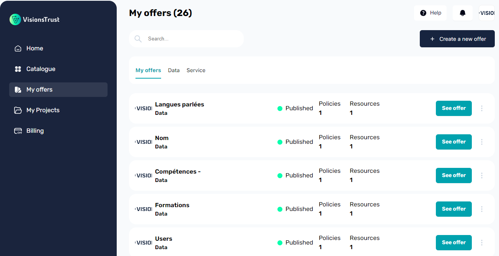
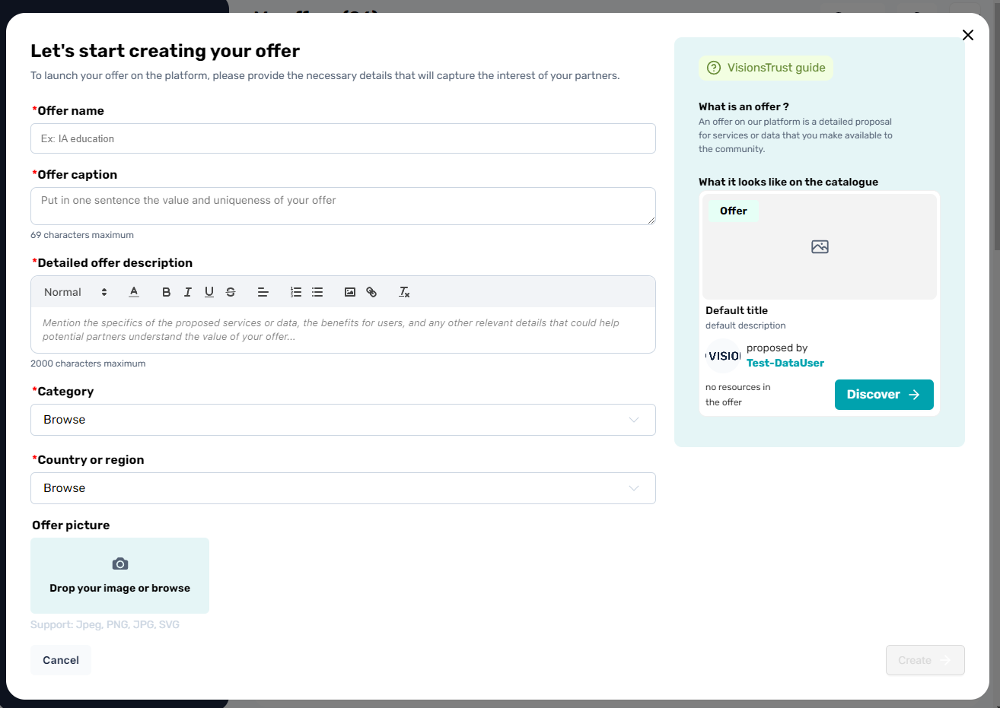
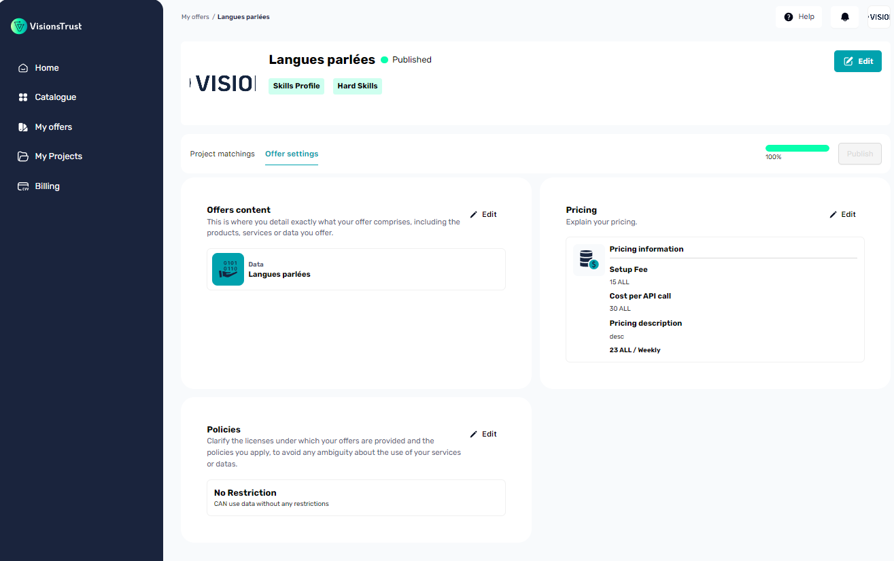
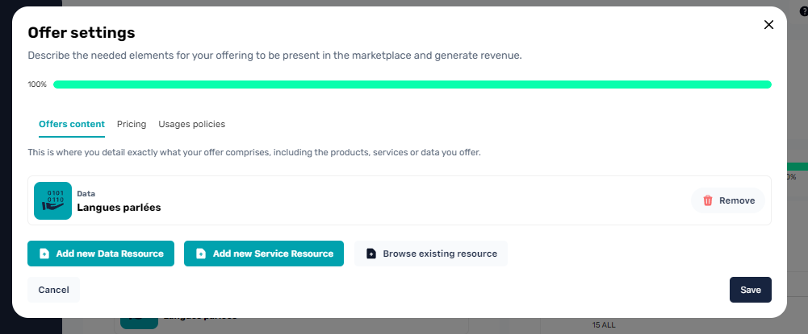

# Creating an offer

## Creating the draft offer

Accessing the environment to create an offer can be done in multiple places. The easies is by clicking on "My Offers" in the sidebar navigation menu which will take you to the list of all your existing, draft and published offers.

By clicking on the _Create new offer_ button, you will enter the offer negotiation flow and a dialog modal should be presented to you to enter the basic information in order to create a draft offer.

The information requested from you is defined in the [offers overview](./overview.md) but here's a quick reminder for this specific step.

### General Information

| Property | Mandatory | Description |
| --- | --- | --- |
| Name | yes | The name of your offer |
| Caption | yes | A short caption to describe your offer for it to be quickly understood when displayed on the catalogue |
| Description | no | A longer description, with rich text support to fully define your offer |
| Category | yes | A list of categories that your offer fits into. This is essential for matching it with projects and providing recommendations. |
| Location | yes | The location in which your offer operates / is stored. |
| Image | no | If set, will be displayed in the catalogue, otherwise, your organization logo will be displayed |

> Setting this initial information will create your offer as draft and will enable you to go in and fine tune the details of that offer in its dedicated page.

## Fine-tuning the settings of the offer

Now that your offer is created, you can fine-tune the settings of your offer and complete whatever is missing in order to [publish](#publishing-the-offer) it.

> All the detailed fields that you can edit on this page are defined in the [offer overview](./overview.md) section, feel free to check this out if you're having trouble understanding what a property is for.

### Adding resources to your offer

Part of the mandatory steps for configuring your offer before publication is to add data and/or service resources to your offer.

An offer **needs** to have at least one resource attached to it to be published.

Clicking on the Edit button of the Offers content section will open a dialog inside of which you can either assign resources you already created or allow you to create resources on the fly which will be automatically assigned to your offer.

Two major actions are possible here and described in their own dedicated documentation section.

- [Creating a data resource](./data-resources.md)
- [Creating a service resource](./service-resources.md)

## Publishing the offer

After completing the mandatory information of your offer, you are able to publish it. The publication status of your offer defines how it can be referenced throughout the catalogue as well as if it will be presented and recommended to other participants.

**A draft offer:**

- Is not available to the catalogue
- Is not recommended to other participants

**A published offer:**

- Is available on the catalogue
- Can be searched in the catalogue
- Is recommended to projects that search the category of offers matching yours
