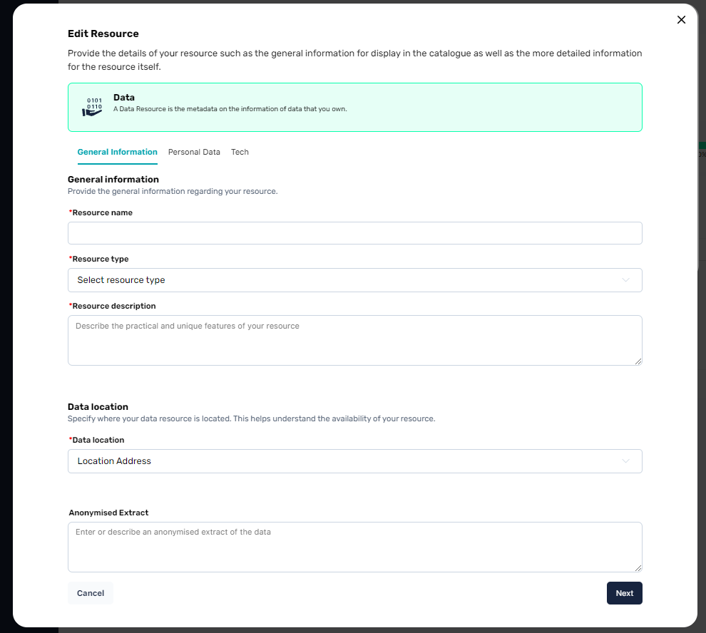

# Data Resources

> _Check the definition for a Resource in the [glossary](../../glossary.md)_

A data resource is the metadata referencing a single unit of data that a provider can own and propose as a service to the catalogue. This can be metadata about a dataset, database or anything that is technically available for others to access.

Resources are the elements that are used in order to compose an offer, which can be then presented in the catalogue.

> A Data Resource alone will never show up in the catalogue. Only the provider of the resource will be able to visualize it unless it is bundled up into an Offer.

## Creating a Data Resource

There are 2 ways to start creating a resource, either from the "My Offers" page in the _Data_ tab or on the fly when creating an offering. The creation flow remains the same in both cases.

In our example, we will be showing the flow when you come from an offering creation and want to create a resource on the fly.

### Defining the base information

The first step is to define the base information for your resource. The following is a recap of what should be defined.

| Property | Mandatory | Description |
| --- | --- | --- |
| Resource name | yes | The name of your resource, which will be displayed when bundled in an offer |
| Resource type | yes | A category for your resource which helps in categorization purposes |
| Resource description | yes | A description for your resource which helps users of your offer in which this resource is present to understand the contents of your resource |
| Data location | yes | Where the data is located geographically |
| Anonymised extract | yes | A JSON anonymized extract of your data for users to understand the structure of the data they will be receiving |

### Personal Data Information

If your data concerns personal data, the Personal Data tab will prompt you to mark this resource as Personal Data and you will optionnally be able to provide a list of descriptions in multiple languages defining your resource to potential end-users that will be giving their consent to share this specific data later down the line.

### Tech Information

The last section of your resource configuration concerns technical configurations for linkage with the [Dataspace Connectors](https://github.com/Prometheus-X-association/dataspace-connector) and for accessing the resources during data exchanges.

> If you are a developer, this is defined more extensively in the [Developer documentation](../../guide/setting-up-a-connector.md)

And that's it, once you're done filling it the mandatory & optional information you can add, save the resource and it will be created.

## Finding your resources

Your resources are directly available in the "My Offers" page, in their respective tabs for *Data* and *Services*.
