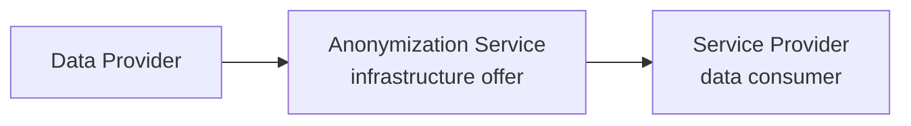
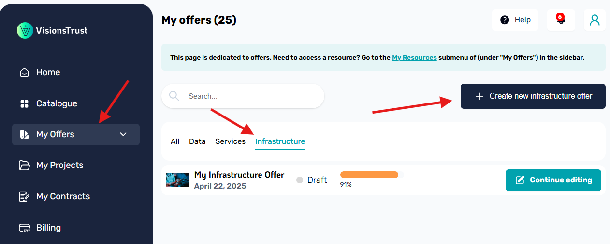
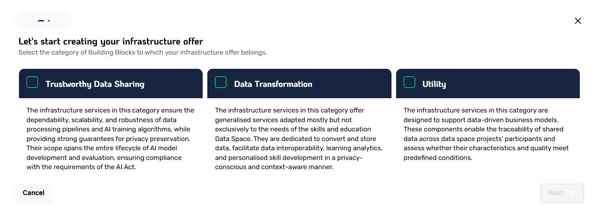
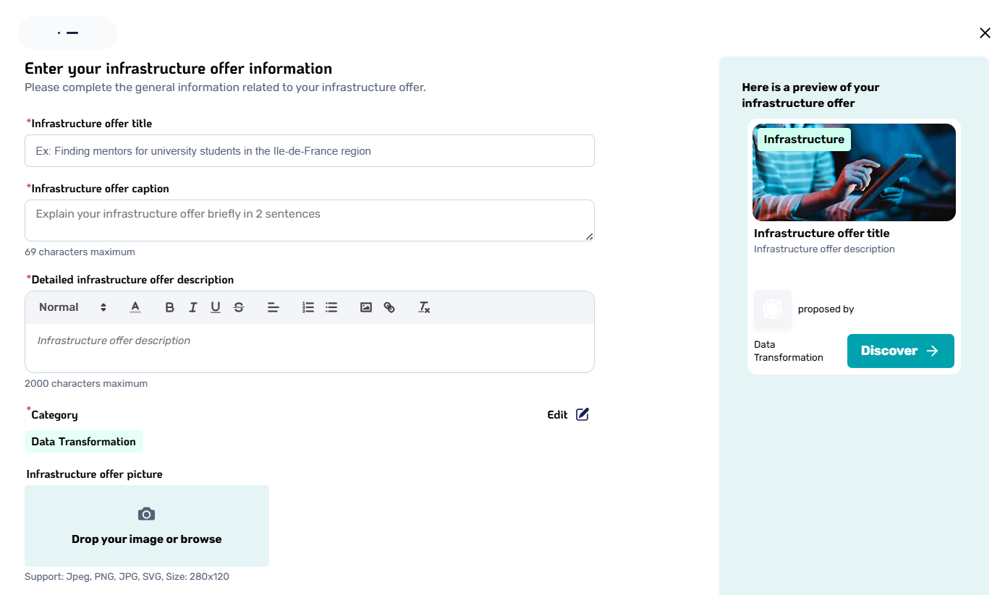
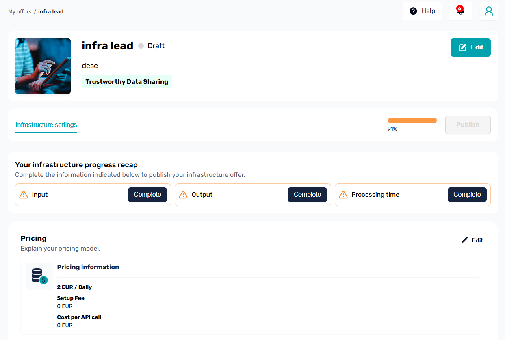

# Infrastructure Offers

An infrastructure offer is a special type of offer that represents a service that is aimed at being placed within service chains to do some kind of data transformation along the data transfer sequence.

Suppose the following service chain, the infrastructure service is the service in the middle providing the anonymization service on the data, taking the input from the data provider and ouptputting the result to the service provider.

> Infrastructure offers are usually implementations of an available Prometheus-X Open Source Building Block.

## Creating the offer

Just like any other regular offer, VisionsTrust provides you with a form to easily register and publish new infrastructure offers.

The workflow is however a little bit simpler, since you do not have to worry about individual resources, which streamlines the process by providing a single interface to create every piece of information representing the infrastructure offer.

Infrastructure Offers are composed of several mandatory fields allowing others to understand what they are, how they are used, what kind of data is expected in input and output along with the pricing options.

To start creating an infrastructure offer, go to My Offers, click on the Infrastructure tab then on the Create New Infrastructure Offer button:

You will be prompted a form to select which category this infrastructure offer corresponds to.

> Please note that if your service is aimed to be used inside a service chain, it **needs** to be a Data Transformation categorized service.

After that, you will need to input the base information for your offer, just like with any other offer

And finally, you will be able to complete the details of your offer, such as setting what kind of input / output data format is expected, what is the expected processing time of the service, the size limit of the data transferred to it and pricing options. 

Once done, your offer becomes publishable for others to discover in the [infrastructure catalogue](../discovery/infrastructure.md).