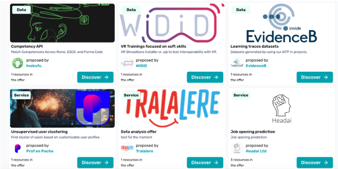
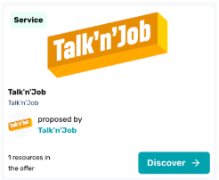
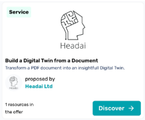
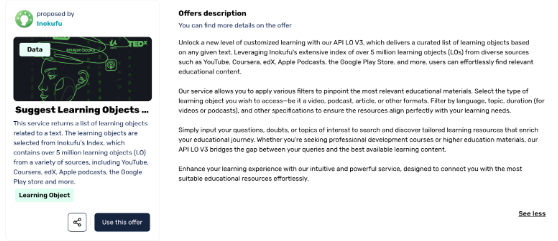
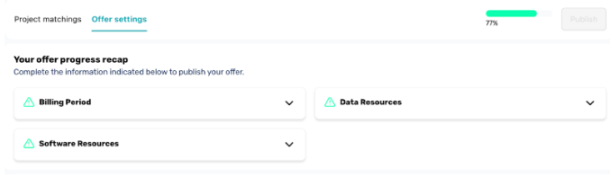

## **How to describe products and services on VisionsTrust: tips and tricks**

### **1\. Define your audience**

Prior to writing your product descriptions, it’s important to identify the audience you want to reach. Gaining insight into your target market enables you to customise your messaging, making sure it resonates with the specific interests and needs of your audience. In order to do this, we encourage you to explore the [**Project**](https://visionstrust.com/catalog/projects) page of the VisionsTrust catalogue, where you will be able to see all the current projects on the platform. Target those which are marked as ‘In search of partners’ as they are the most likely to be interested in your offers. For more information on the project leaders who initiated the project you are interested in, check out the [**Organisations**](https://visionstrust.com/catalog/organisations) page of the catalogue.

### **2\. Relate to your audience**

Once you understand the precise objectives the project leaders want to achieve, you need to look at your offers from their perspective. Instead of simply outlining the features of your product or service, focus on connecting them to what matters most to the project leaders. Highlighting this connection can effectively show why your offerings are relevant and valuable to them.

### **3\. Use the form wisely** 

Now that you have identified your target project leaders and the information about your offerings that you want to convey, you must fill in the form to describe your offer. Keep in mind that when scanning the catalogue, project leaders will see first the offer picture, the offer name and the offer caption. If these elements caught their attention, they will click on “Discover” to display the detailed offer description \- do not neglect these three elements, they are essential\! 

*View from the VisionsTrust catalogue: the project leaders will see first the offer category, the offer image, title and caption.* 

The form to register your offer in the VisionsTrust catalogue consists in the following elements (all three are **mandatory**):

* **Offer name**: the name needs to be short, clear and to the point. Make sure the naming of your offer is understandable to the general public, do not get technical, avoid internal lexicon or jargon. Try to keep the name of your offer below 22 characters. 

***Example:***   
*Don’t: “Supportsquare NV (participating in MAIA-X)”*  
*The title does not clearly reflect what this offer is about.*  
**  
*Do: “VR/AR Training”*   
*This title allows one to immediately grasp what the offer consists in.*

* **Offer caption**: you are invited here to describe your offer in one catchy sentence (69 characters max.). Focus here on the value proposition of your offer, and what makes it unique compared to others. Put some thought into the offer caption, together with the image and name this is what will appear in the vignette of your offer in the catalogue. 

**Example:**   
*Don’t: repeat the offer title in the offer caption:*  

*Do: Catchy, short sentence that illustrates simply the value and uniqueness of the offer: “Transform a PDF document into an insightful Digital Twin.”*  

* **Detailed offer description**: You have 2000 characters to provide an effective description. We encourage you to combine both bullet points and plain paragraphs. Using paragraphs allows you to craft a narrative around your offer, highlighting the reasons why it’s a worthwhile purchase. This approach also provides an opportunity to showcase your brand’s unique voice, whether through a lighthearted, conversational style or a more formal tone. To complement these descriptions, adding bullet-point lists with concise phrases will outline key features or specifications. 

**Example:**   
*Do: use the detailed description to give context, and details to the potential customer.*   
****

You have the opportunity to also add **an image** to your offer, even if this is non-mandatory, we strongly recommend that you do it. Images are an effective method of garnering customers' attention and helping them understand your offers. This will increase your visibility and make your offer more appealing to prospective customers. Please upload only high quality images: 

* Minimum resolution: 250x120 pixels  
* Maximum resolution: 1200x800 pixels  
* Recommended formats: JPEG or PNG.

Do not neglect or forget to fill out the **Offer settings tab**, this is where you can indicate  the policy, pricing and add resources to your offer. Without these elements, you will not be able to publish the offer on the catalogue. 

### **4\. Be as specific and concise as possible**

When crafting descriptions, choose precise language to highlight the features of your products or services. Generic phrases like 'high quality' can become overused and lose their impact. To make your descriptions more compelling, focus on providing concrete details that clearly demonstrate the value and uniqueness of your offerings. Focus on only the information that is essential or relevant. Do not go into too much detail when it comes to technicalities\! Keep in mind that project leaders are generally not technical people. You want them to easily understand why they should buy your offers, even when they scan the page.

### **5\. Focus on benefits**

While your description should outline your offerings' features, specifications or functions, try to focus on their benefits. Demonstrate how these offerings will address the project leader objectives. These benefits serve as an effective method of differentiating your offerings from similar ones. 

### **6\. Provide measurable evidence**

When describing your products or services, it’s important to back up bold claims with concrete data. If you assert that your product is the most effective or your service outperforms competitors, provide measurable proof to validate these statements. This not only showcases the value of your offerings but also enhances your credibility, fostering greater trust with potential customers and increasing the likelihood of a purchase.

### **7\. Use English and proofread before publishing**

Please write your descriptions in British English, and carefully review your descriptions before publishing them on the platform. Proofreading helps catch spelling or grammatical mistakes that could undermine your brand’s credibility and professional image. Clear, polished content reflects your organisation’s attention to detail and plays a key role in building trust with potential customers.
