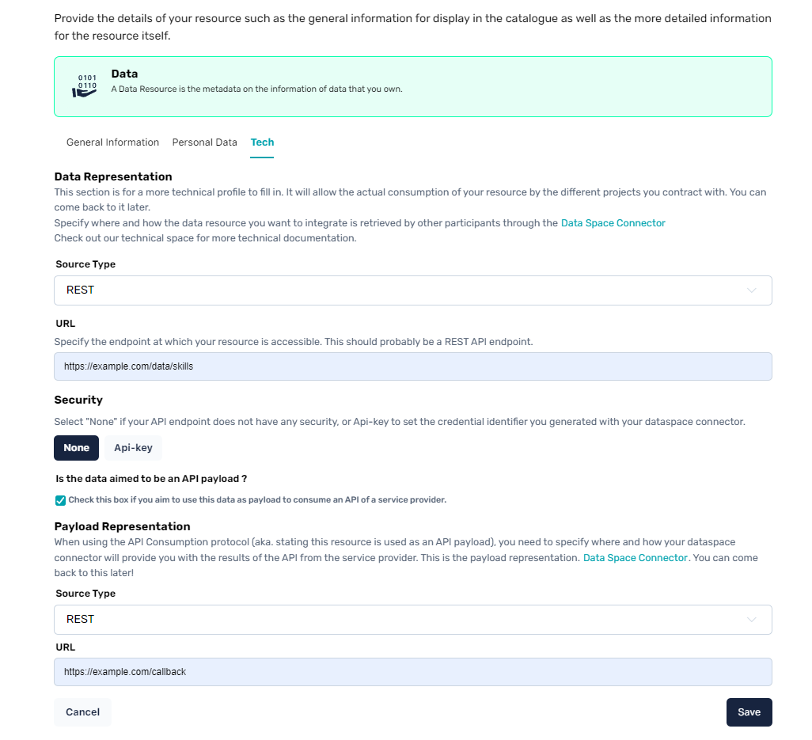
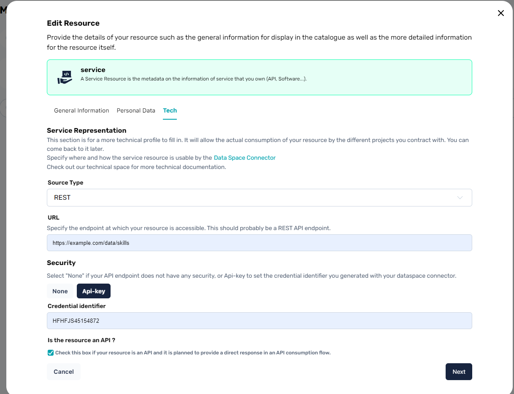

# Configuring Resources for API Consumption

The API Consumption protocol is a process in which PDCs (Prometheus-X Dataspace Connector) are used in a way to allow a Data Provider to **consume** a service from a Service Provider just like it would consume an API to receive data. To enable this, resources from both parties need to have metadata allowing the data or service to be used by this protocol.

## Configuring a Data Resource for API Consumption

From the **Data Provider**'s side, the data resource informed in the catalogue should be marked as **aimed to be an API payload**. This can be done through your data resource creation or edit page as shown in the image below.

As for a regular data representation for the resource, it is essential to inform what type of source the data is retrieved from, what endpoint the PDC should call to get the data and if protected, the [credential identifier](https://github.com/Prometheus-X-association/dataspace-connector/blob/main/docs/CREDENTIALS.md) associated to this resource.

By configuring the data resource that way, the Data Provider enables his PDC to automatically understand that this data is to be used for an API Consumption protocol and make the necessary adjustments in the data exchange flow to retrieve the data coming back from the Service Provider's API Service.

### Note: Configuration for PII

If the data resource is marked as including PII data, the URL defined for the endpoint to fetch the data should contain a **{userId}** that will be automatically be replaced by the PDC during the data exchange protocol by the identifier of the individual concerned by the data transaction. This is assuming that the data provider correctly configured his [user registration](https://github.com/Prometheus-X-association/dataspace-connector/blob/main/docs/USER_MANAGEMENT.md) through the PDC.

This is exactly the same process as defining a non-payload data resource.

## Configuring a Service Resource for API Consumption

From the **Service Provider**'s side, marking a service as an API is as simple as checking a box in the Service Resource's creation or edit page (as shown in the image below).

Marking a service resource as being an API allows the PDC to automatically adjust the data exchange protocol and send the API response back to the Data Provider.
