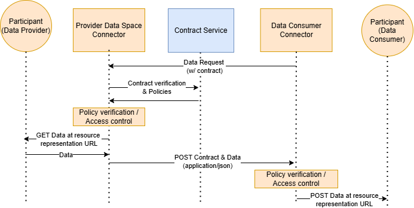
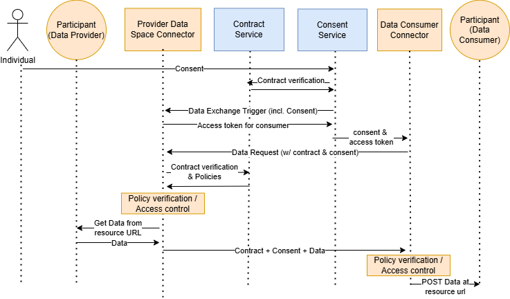
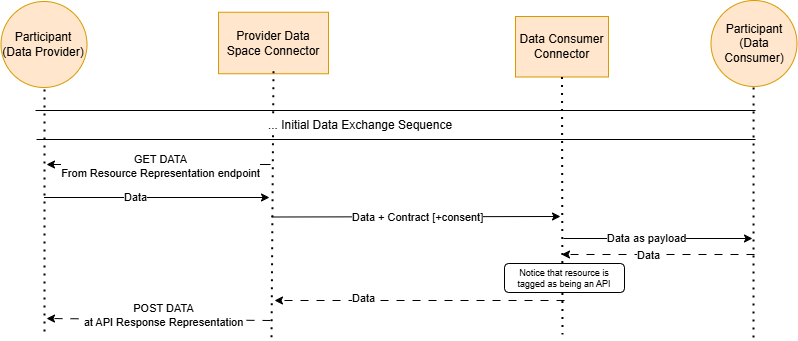

# Developer Guide

Participants of the dataspace that use VisionsTrust services need to integrate their solution and configure their assets in order for the dataspace to know how to interact with these during data exchange processes. 

This guide will go over the different requirements and steps to do in order to get your first successful data exchange up and running.

## Non Technical Requirements

Let's go over the different things you need to make sure are done before even considering setting up the technical elements for enabling data exchanges.

| Requirement | Why it's needed |
| --- | --- |
| [Onboarding to VisionsTrust](../application/onboarding.md) | Creating an account on VisionsTrust is essential to be registered as a participant of the data space. Without this, your organization will not be recognized in the dataspace and no other participant will be enable to interact with you. |
| [Registering Offers](../application/registering-resources/overview.md) | If you are a data provider, you will need to ensure you have at least one offer available that contains a data resource. If you are a service provider, you will need to ensure you have at least one offer available that contains a service resource. |
| [Creating or joining a project](../application/negotiation/project-negotiation.md) | Data exchanges cannot take place if you are not present in any contract existing in the dataspace. In order to trigger data exchanges with participants that exist in the same contract, you should join or create a project, go through the negotiation processes and then sign that contract (and make sure the other party has signed as well). |

If you or anyone in your organization has already completed these steps, you can move on to the Technical Requirements.

## Technical Requirements

Let's now go over the technical requirements in order for a participant to communicate with a dataspace and more specifically with the VisionsTrust services.

| Requirement | Why it's needed |
| --- | --- |
| [Setting up a Dataspace Connector](./setting-up-a-connector.md) | Each participant in the dataspace needs a way to communicate with the dataspace components and with other participants in the network. Although it is possible to configure a customized implementation of every API needed to ensure secure communication, it is strongly advised to use the open source Prometheus-x Dataspace Connector. |
| [Setting up the technical information of your resources](./setting-up-technical-resources.md) | For a resource to become available in a data exchange, there are some technical information to be setup on the metadata of that resource in the catalogue. Chances are that if a less-technical profile has created your resources, this information might be missing. |

## Actions towards realizing the first data exchange

If all the non technical & technical requirements have been checked off your list, you should be ready to realize your first data exchange.

You can get started by going to the full Prometheus-X connector documentation that will take you through how data exchanges work in detail as well as the details that are important to know to make a data exchange work or you if you just need an overview or a refreher, you can read the data exchange protocols overview in the next section.

[Get Started](https://github.com/Prometheus-X-association/dataspace-connector/blob/main/docs/RESOURCE_REPRESENTATION.md){ .md-button }

## Data Exchange Protocols Overview

### Non-personal data exchange

The actors involved in the non personal B2B data exchange are the following:
|Actor|Description|
|-|-|
|Data Provider|A participant of the data space providing data. In this flow, we consider the data provider as both the entity responsible for the participant organisation and the participant application, which can be an API, a data source, or any kind of application.|
|Data Space Connector|Both participants have a data space connector in order to communicate with the infrastructure services and the other party's connector|
|Contract Service|An infrastructure service of the data space managing contracts and policies on data exchanges. It is used in this flow to verify the status and content of the contract to allow or block data exchange requests.|

> This process does not go over the negotiation and contractualisation process and assumes a data sharing agreement contract has already been signed between the two parties or that they are both part of a [project](../application/projects/overview.md).

### Consent-Driven data exchange

In addition to the actors from the previous data exchange flow, the consent-driven data exchange is triggered by an individual giving his consent for data sharing and thus, this adds a couple of actors to the flow.
|Actor|Description|
|-|-|
|Individual|The individual (user) who's data is being shared|
|Consent Service|The Personal Data Intermediary's consent service of the individual that manages consent and passes it around in the data exchange flow.|

1. The individual, through his PDI will grant consent for a specific data sharing.
2. The consent service will communicate with the contract service to verify the status of the data sharing contract that exists between the two participants for the wanted data exchange.
3. The consent service notifies the Provider's data space connector that an exchange needs to happen by providing the consent
4. The connector generates an access token to be used by the consumer and sends it back to the consent service, which will associate the token to the consent before sending it to the consumer's connector.
5. The consent service sends the consent to the Data space connector of the data consumer along with information as to what endpoint of the provider's data space connector to call to get data
6. The consumer connector makes the data request to the provider by providing the consent

The rest of the flow is in line with the process during a non-personal B2B data exchange.

### API Consumption protocol

#### Configuring Resources for API Consumption

The API Consumption protocol is a process in which PDCs are used in a way to allow Data Providers to **consume** a service from a Service Provider just like it would consume an API to receive data. To enable this, resources from both parties need to have metadata allowing the data or service to be used by this protocol.

#### Configuring a Data Resource for API Consumption

From the **Data Provider**'s side, the data resource informed in the catalogue should be marked as **aimed to be an API payload**. This can be managed on your used catalogue.

Similar to a regular [data representation](./setting-up-technical-resources.md#data-representation) for the resource, it is essential to inform what type of source the data is retrieved from, what endpoint the PDC should call to get the data and if protected, the [credential identifier](https://github.com/Prometheus-X-association/dataspace-connector/wiki/Credentials) associated to this resource.

By configuring the data resource that way, the Data Provider enables his PDC to automatically understand that this data is to be used for an API Consumption protocol and make the necessary adjustments in the data exchange flow to retrieve the data coming back from the Service Provider's API Service.

### Service Chain Protocol

Service chains are complex and contain a lot of information. Our recommendation is that you start by looking at [how to set them up and how they are represented in Projects](../application/projects/service-chains.md) to understand what they are for and how to use them first, and then head over to the official complete [Prometheus-X documentation for service chains](https://github.com/Prometheus-X-association/dataspace-connector/wiki/Service-Chains) that will walk you through all of the technical details on how to work with them, what it implies for your implementation and connectors.

Keep in mind that working with service chains will involve the following :

* Having signed the project agreement to authorize your offer to be part of a service chain.
* Being a member of a project and having your offer included inside of a service chain built by the orchestrator of that project.
* Adapting the implementation of the communication between your connector and your resource server to handle service chains (can be worked around by using a proxy app).