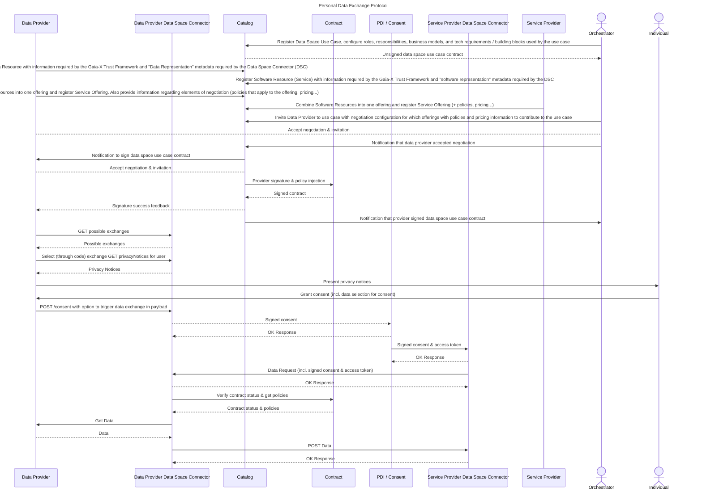

# Integrating Consent

In the data space, if you are a **data provider** or **service provider** running an application on which users connect to and interact with, you might want to propose a direct solution to your users for them to grant their consent for a data exchange through your platform.

The Data Space Connector facilitates this integration by providing proxy endpoints to the consent service to handle consent management.

> ⚠ Please remember to register your user to your Data Space Connector before attempting any of the operations below as the userId is necessary for most processes.

## Getting the available data exchanges

The first step of the process is getting the available data exchanges.

> ⚠ Please ensure you have previously negotiated on at least one data exchange within a data space use case or directly with another participant within the catalog. Without signed agreements, the consent service will not know what data exchanges can be proposed to the individual.

**GET Request:**

Endpoint: `/private/consent/exchanges/:as`

Parameters:

- `as` (required): Can be either `provider` or `consumer` and defines if you want to retrieve available exchanges where you provide or consume data

Description: Retrieve all the available exchanges from signed contracts you have in the data space.

Example Request:

```http
GET /private/consent/exchanges/provider?userId=abc HTTP/1.1
Host: YOUR_DATASPACE_CONNECTOR_ENDPOINT
```

<details>
    <summary>Example response</summary>

```json
{
	"timestamp": 1708970136502,
	"code": 200,
	"content": {
		"participant": {
			"selfDescription": "https://api.visionstrust.com/v1/catalog/participants/656dfb3e282d47cfa6b66b30",
			"base64SelfDescription": "aHR0cHM6Ly9hcGkudmlzaW9uc3RydXN0LmNvbS92MS9jYXRhbG9nL3BhcnRpY2lwYW50cy82NTZkZmIzZTI4MmQ0N2NmYTZiNjZiMzA="
		},
		"exchanges": [
			{
				"contract": "https://contract.visionstrust.com/bilaterals/65d8c1b77fb307daf47471a5",
				"participantSelfDescription": "https://api.visionstrust.com/v1/catalog/participants/656dfb3e282d47cfa6b66b2a",
				"base64SelfDescription": "aHR0cHM6Ly9hcGkudmlzaW9uc3RydXN0LmNvbS92MS9jYXRhbG9nL3BhcnRpY2lwYW50cy82NTZkZmIzZTI4MmQ0N2NmYTZiNjZiMmE=",
				"privacyNoticeEndpoint": "https://provider-data-connector-253244a6c16c.herokuapp.com/private/consent/65646d4320ec42ff2e719706/aHR0cHM6Ly9hcGkudmlzaW9uc3RydXN0LmNvbS92MS9jYXRhbG9nL3BhcnRpY2lwYW50cy82NTZkZmIzZTI4MmQ0N2NmYTZiNjZiMzA=/aHR0cHM6Ly9hcGkudmlzaW9uc3RydXN0LmNvbS92MS9jYXRhbG9nL3BhcnRpY2lwYW50cy82NTZkZmIzZTI4MmQ0N2NmYTZiNjZiMmE="
			},
			{
				"contract": "https://contract.visionstrust.com/bilaterals/65d8c7a57fb307daf47472bd",
				"participantSelfDescription": "https://api.visionstrust.com/v1/catalog/participants/656dfb3e282d47cfa6b66b2a",
				"base64SelfDescription": "aHR0cHM6Ly9hcGkudmlzaW9uc3RydXN0LmNvbS92MS9jYXRhbG9nL3BhcnRpY2lwYW50cy82NTZkZmIzZTI4MmQ0N2NmYTZiNjZiMmE=",
				"privacyNoticeEndpoint": "https://provider-data-connector-253244a6c16c.herokuapp.com/private/consent/65646d4320ec42ff2e719706/aHR0cHM6Ly9hcGkudmlzaW9uc3RydXN0LmNvbS92MS9jYXRhbG9nL3BhcnRpY2lwYW50cy82NTZkZmIzZTI4MmQ0N2NmYTZiNjZiMzA=/aHR0cHM6Ly9hcGkudmlzaW9uc3RydXN0LmNvbS92MS9jYXRhbG9nL3BhcnRpY2lwYW50cy82NTZkZmIzZTI4MmQ0N2NmYTZiNjZiMmE="
			},
			{
				"contract": "https://contract.visionstrust.com/bilaterals/65dc532d18916161a201163f",
				"participantSelfDescription": "https://api.visionstrust.com/v1/catalog/participants/656dfb3e282d47cfa6b66b2a",
				"base64SelfDescription": "aHR0cHM6Ly9hcGkudmlzaW9uc3RydXN0LmNvbS92MS9jYXRhbG9nL3BhcnRpY2lwYW50cy82NTZkZmIzZTI4MmQ0N2NmYTZiNjZiMmE=",
				"privacyNoticeEndpoint": "https://provider-data-connector-253244a6c16c.herokuapp.com/private/consent/65646d4320ec42ff2e719706/aHR0cHM6Ly9hcGkudmlzaW9uc3RydXN0LmNvbS92MS9jYXRhbG9nL3BhcnRpY2lwYW50cy82NTZkZmIzZTI4MmQ0N2NmYTZiNjZiMzA=/aHR0cHM6Ly9hcGkudmlzaW9uc3RydXN0LmNvbS92MS9jYXRhbG9nL3BhcnRpY2lwYW50cy82NTZkZmIzZTI4MmQ0N2NmYTZiNjZiMmE="
			},
			{
				"contract": "https://contract.visionstrust.com/contracts/65c5e9969e9995e62ff695e9",
				"participantSelfDescription": "656dfb3e282d47cfa6b66b2a",
				"base64SelfDescription": "NjU2ZGZiM2UyODJkNDdjZmE2YjY2YjJh",
				"privacyNoticeEndpoint": "https://provider-data-connector-253244a6c16c.herokuapp.com/private/consent/65646d4320ec42ff2e719706/aHR0cHM6Ly9hcGkudmlzaW9uc3RydXN0LmNvbS92MS9jYXRhbG9nL3BhcnRpY2lwYW50cy82NTZkZmIzZTI4MmQ0N2NmYTZiNjZiMzA=/NjU2ZGZiM2UyODJkNDdjZmE2YjY2YjJh"
			},
			{
				"contract": "https://contract.visionstrust.com/contracts/65c5eeab8d6b6a5c360f22c7",
				"participantSelfDescription": "656dfb3e282d47cfa6b66b2a",
				"base64SelfDescription": "NjU2ZGZiM2UyODJkNDdjZmE2YjY2YjJh",
				"privacyNoticeEndpoint": "https://provider-data-connector-253244a6c16c.herokuapp.com/private/consent/65646d4320ec42ff2e719706/aHR0cHM6Ly9hcGkudmlzaW9uc3RydXN0LmNvbS92MS9jYXRhbG9nL3BhcnRpY2lwYW50cy82NTZkZmIzZTI4MmQ0N2NmYTZiNjZiMzA=/NjU2ZGZiM2UyODJkNDdjZmE2YjY2YjJh"
			},
			{
				"contract": "https://contract.visionstrust.com/contracts/65c5eeab8d6b6a5c360f22c7",
				"participantSelfDescription": "https://api.visionstrust.com/v1/catalog/participants/656dfb3e282d47cfa6b66b2a",
				"base64SelfDescription": "aHR0cHM6Ly9hcGkudmlzaW9uc3RydXN0LmNvbS92MS9jYXRhbG9nL3BhcnRpY2lwYW50cy82NTZkZmIzZTI4MmQ0N2NmYTZiNjZiMmE=",
				"privacyNoticeEndpoint": "https://provider-data-connector-253244a6c16c.herokuapp.com/private/consent/65646d4320ec42ff2e719706/aHR0cHM6Ly9hcGkudmlzaW9uc3RydXN0LmNvbS92MS9jYXRhbG9nL3BhcnRpY2lwYW50cy82NTZkZmIzZTI4MmQ0N2NmYTZiNjZiMzA=/aHR0cHM6Ly9hcGkudmlzaW9uc3RydXN0LmNvbS92MS9jYXRhbG9nL3BhcnRpY2lwYW50cy82NTZkZmIzZTI4MmQ0N2NmYTZiNjZiMmE="
			},
			{
				"contract": "https://contract.visionstrust.com/contracts/65c5f64e8d6b6a5c360f2305",
				"participantSelfDescription": "656dfb3e282d47cfa6b66b2a",
				"base64SelfDescription": "NjU2ZGZiM2UyODJkNDdjZmE2YjY2YjJh",
				"privacyNoticeEndpoint": "https://provider-data-connector-253244a6c16c.herokuapp.com/private/consent/65646d4320ec42ff2e719706/aHR0cHM6Ly9hcGkudmlzaW9uc3RydXN0LmNvbS92MS9jYXRhbG9nL3BhcnRpY2lwYW50cy82NTZkZmIzZTI4MmQ0N2NmYTZiNjZiMzA=/NjU2ZGZiM2UyODJkNDdjZmE2YjY2YjJh"
			},
			{
				"contract": "https://contract.visionstrust.com/contracts/65c5f64e8d6b6a5c360f2305",
				"participantSelfDescription": "https://api.visionstrust.com/v1/catalog/participants/656dfb3e282d47cfa6b66b2a",
				"base64SelfDescription": "aHR0cHM6Ly9hcGkudmlzaW9uc3RydXN0LmNvbS92MS9jYXRhbG9nL3BhcnRpY2lwYW50cy82NTZkZmIzZTI4MmQ0N2NmYTZiNjZiMmE=",
				"privacyNoticeEndpoint": "https://provider-data-connector-253244a6c16c.herokuapp.com/private/consent/65646d4320ec42ff2e719706/aHR0cHM6Ly9hcGkudmlzaW9uc3RydXN0LmNvbS92MS9jYXRhbG9nL3BhcnRpY2lwYW50cy82NTZkZmIzZTI4MmQ0N2NmYTZiNjZiMzA=/aHR0cHM6Ly9hcGkudmlzaW9uc3RydXN0LmNvbS92MS9jYXRhbG9nL3BhcnRpY2lwYW50cy82NTZkZmIzZTI4MmQ0N2NmYTZiNjZiMmE="
			},
			{
				"contract": "https://contract.visionstrust.com/contracts/65d47d17fad6f664f641a90f",
				"participantSelfDescription": "656dfb3e282d47cfa6b66b2a",
				"base64SelfDescription": "NjU2ZGZiM2UyODJkNDdjZmE2YjY2YjJh",
				"privacyNoticeEndpoint": "https://provider-data-connector-253244a6c16c.herokuapp.com/private/consent/65646d4320ec42ff2e719706/aHR0cHM6Ly9hcGkudmlzaW9uc3RydXN0LmNvbS92MS9jYXRhbG9nL3BhcnRpY2lwYW50cy82NTZkZmIzZTI4MmQ0N2NmYTZiNjZiMzA=/NjU2ZGZiM2UyODJkNDdjZmE2YjY2YjJh"
			},
			{
				"contract": "https://contract.visionstrust.com/contracts/65d47d17fad6f664f641a90f",
				"participantSelfDescription": "https://api.visionstrust.com/v1/catalog/participants/656dfb3e282d47cfa6b66b2a",
				"base64SelfDescription": "aHR0cHM6Ly9hcGkudmlzaW9uc3RydXN0LmNvbS92MS9jYXRhbG9nL3BhcnRpY2lwYW50cy82NTZkZmIzZTI4MmQ0N2NmYTZiNjZiMmE=",
				"privacyNoticeEndpoint": "https://provider-data-connector-253244a6c16c.herokuapp.com/private/consent/65646d4320ec42ff2e719706/aHR0cHM6Ly9hcGkudmlzaW9uc3RydXN0LmNvbS92MS9jYXRhbG9nL3BhcnRpY2lwYW50cy82NTZkZmIzZTI4MmQ0N2NmYTZiNjZiMzA=/aHR0cHM6Ly9hcGkudmlzaW9uc3RydXN0LmNvbS92MS9jYXRhbG9nL3BhcnRpY2lwYW50cy82NTZkZmIzZTI4MmQ0N2NmYTZiNjZiMmE="
			},
			{
				"contract": "https://contract.visionstrust.com/contracts/65d4c872e760d67ca55e3abf",
				"participantSelfDescription": "656dfb3e282d47cfa6b66b2a",
				"base64SelfDescription": "NjU2ZGZiM2UyODJkNDdjZmE2YjY2YjJh",
				"privacyNoticeEndpoint": "https://provider-data-connector-253244a6c16c.herokuapp.com/private/consent/65646d4320ec42ff2e719706/aHR0cHM6Ly9hcGkudmlzaW9uc3RydXN0LmNvbS92MS9jYXRhbG9nL3BhcnRpY2lwYW50cy82NTZkZmIzZTI4MmQ0N2NmYTZiNjZiMzA=/NjU2ZGZiM2UyODJkNDdjZmE2YjY2YjJh"
			},
			{
				"contract": "https://contract.visionstrust.com/contracts/65d4c872e760d67ca55e3abf",
				"participantSelfDescription": "https://api.visionstrust.com/v1/catalog/participants/656dfb3e282d47cfa6b66b2a",
				"base64SelfDescription": "aHR0cHM6Ly9hcGkudmlzaW9uc3RydXN0LmNvbS92MS9jYXRhbG9nL3BhcnRpY2lwYW50cy82NTZkZmIzZTI4MmQ0N2NmYTZiNjZiMmE=",
				"privacyNoticeEndpoint": "https://provider-data-connector-253244a6c16c.herokuapp.com/private/consent/65646d4320ec42ff2e719706/aHR0cHM6Ly9hcGkudmlzaW9uc3RydXN0LmNvbS92MS9jYXRhbG9nL3BhcnRpY2lwYW50cy82NTZkZmIzZTI4MmQ0N2NmYTZiNjZiMzA=/aHR0cHM6Ly9hcGkudmlzaW9uc3RydXN0LmNvbS92MS9jYXRhbG9nL3BhcnRpY2lwYW50cy82NTZkZmIzZTI4MmQ0N2NmYTZiNjZiMmE="
			},
			{
				"contract": "https://contract.visionstrust.com/contracts/65d4e6d7a92c1b0546043321",
				"participantSelfDescription": "656dfb3e282d47cfa6b66b2a",
				"base64SelfDescription": "NjU2ZGZiM2UyODJkNDdjZmE2YjY2YjJh",
				"privacyNoticeEndpoint": "https://provider-data-connector-253244a6c16c.herokuapp.com/private/consent/65646d4320ec42ff2e719706/aHR0cHM6Ly9hcGkudmlzaW9uc3RydXN0LmNvbS92MS9jYXRhbG9nL3BhcnRpY2lwYW50cy82NTZkZmIzZTI4MmQ0N2NmYTZiNjZiMzA=/NjU2ZGZiM2UyODJkNDdjZmE2YjY2YjJh"
			},
			{
				"contract": "https://contract.visionstrust.com/contracts/65d861b98ca382c15b966421",
				"participantSelfDescription": "https://api.visionstrust.com/v1/catalog/participants/656dfb3e282d47cfa6b66b2a",
				"base64SelfDescription": "aHR0cHM6Ly9hcGkudmlzaW9uc3RydXN0LmNvbS92MS9jYXRhbG9nL3BhcnRpY2lwYW50cy82NTZkZmIzZTI4MmQ0N2NmYTZiNjZiMmE=",
				"privacyNoticeEndpoint": "https://provider-data-connector-253244a6c16c.herokuapp.com/private/consent/65646d4320ec42ff2e719706/aHR0cHM6Ly9hcGkudmlzaW9uc3RydXN0LmNvbS92MS9jYXRhbG9nL3BhcnRpY2lwYW50cy82NTZkZmIzZTI4MmQ0N2NmYTZiNjZiMzA=/aHR0cHM6Ly9hcGkudmlzaW9uc3RydXN0LmNvbS92MS9jYXRhbG9nL3BhcnRpY2lwYW50cy82NTZkZmIzZTI4MmQ0N2NmYTZiNjZiMmE="
			}
		]
	}
}
```

</details>

> ℹ This API provides information that you will need to specify to then load the available privacy notices for an individual. The `privacyNoticeEndpoint` facilitates the next API call to make to get the available exchanges for the associated contract.

> ⚠ If the userId query parameter is not informed, the `privacyNoticeEndpoint` field will include the string `{userId}` as its last parameter instead and you will need to build the url and replace this part with the userId of the user you wish to load the privacy notices for.

## Getting Privacy Notices for the individual

Now that the available exchanges were provided to your application. You can now decide for which contract you wish to propose a data exchange to your user.

To retrieve the Privacy Notices from an available exchange you can directly make an API call to the provided `privacyNoticeEndpoint`.

> :grey_exclamation: As mentionned above, if you have not provided the userId query parameter when getting the available exchanges, you will need to build the `privacyNoticeEndpoint` with the corresponding userId before making the request.

**GET Request:**

Endpoint: `/private/consents/:userId/:providerId/:consumerId`

Parameters:

- `userId` (required): Your user's internal ID in your system
- `providerId` (required): The base64 representation of the provider's self description. Provided by the call to get available exchanges.
- `consumerId` (required): The base64 representation of the provider's self description. Provided by the call to get available exchanges.

Description: Retrieve privacy notices for the selected data exchange

Example Request:

```http
GET /private/consent/65646d4320ec42ff2e719706/aHR0cHM6Ly9hcGkudmlzaW9uc3RydXN0LmNvbS92MS9jYXRhbG9nL3BhcnRpY2lwYW50cy82NTZkZmIzZTI4MmQ0N2NmYTZiNjZiMzA=/aHR0cHM6Ly9hcGkudmlzaW9uc3RydXN0LmNvbS92MS9jYXRhbG9nL3BhcnRpY2lwYW50cy82NTZkZmIzZTI4MmQ0N2NmYTZiNjZiMmE= HTTP/1.1
Host: YOUR_DATASPACE_CONNECTOR_ENDPOINT
```

<details>
    <summary>Example response</summary>

```json
{
	"timestamp": 1708966274581,
	"code": 200,
	"content": [
		{
			"_id": "65d8a74dfaaecad66a4acf19",
			"contract": "http://host.docker.internal:8888/bilaterals/65d86f96dd837db34716ab42",
			"lastUpdated": "1708697421400",
			"dataProvider": "http://host.docker.internal:4040/v1/catalog/participants/6564abb5d853e8e05b132057",
			"controllerDetails": {
				"name": "http://host.docker.internal:4040/v1/catalog/participants/6564abb5d853e8e05b132057",
				"contact": "",
				"representative": "",
				"dpo": {
					"name": "",
					"contact": ""
				}
			},
			"purposes": [
				{
					"purpose": "http://host.docker.internal:4040/v1/catalog/serviceofferings/65d86f82e2f9621a2c89ae7a",
					"legalBasis": "",
					"_id": "65d8a74dfaaecad66a4acf1a"
				}
			],
			"categoriesOfData": [],
			"data": [
				"http://host.docker.internal:4040/v1/catalog/serviceofferings/65d86ecae2f9621a2c89ad45"
			],
			"recipients": [
				"http://host.docker.internal:4040/v1/catalog/participants/6564aaebd853e8e05b1317c1"
			],
			"internationalTransfers": {
				"countries": [],
				"safeguards": ""
			},
			"retentionPeriod": "",
			"piiPrincipalRights": [],
			"withdrawalOfConsent": "",
			"complaintRights": "",
			"provisionRequirements": "",
			"automatedDecisionMaking": {
				"details": ""
			},
			"schema_version": "0.1.0",
			"createdAt": "2024-02-23T14:10:21.422Z",
			"updatedAt": "2024-02-23T14:10:21.422Z",
			"__v": 0
		},
		{
			"_id": "65d8a74dfaaecad66a4acf1c",
			"contract": "http://host.docker.internal:8888/contracts/65d87043dd837db34716ab61",
			"lastUpdated": "1708697421400",
			"dataProvider": "http://host.docker.internal:4040/v1/catalog/participants/6564abb5d853e8e05b132057",
			"controllerDetails": {
				"name": "http://host.docker.internal:4040/v1/catalog/participants/6564abb5d853e8e05b132057",
				"contact": "",
				"representative": "",
				"dpo": {
					"name": "",
					"contact": ""
				}
			},
			"purposes": [
				{
					"purpose": "http://host.docker.internal:4040/v1/catalog/serviceofferings/65d87126e2f9621a2c89b41b",
					"legalBasis": "",
					"_id": "65d8a74dfaaecad66a4acf1d"
				}
			],
			"categoriesOfData": [],
			"data": [
				"http://host.docker.internal:4040/v1/catalog/serviceofferings/65d87093e2f9621a2c89b2f0"
			],
			"recipients": [
				"http://host.docker.internal:4040/v1/catalog/participants/6564aaebd853e8e05b1317c1"
			],
			"internationalTransfers": {
				"countries": [],
				"safeguards": ""
			},
			"retentionPeriod": "",
			"piiPrincipalRights": [],
			"withdrawalOfConsent": "",
			"complaintRights": "",
			"provisionRequirements": "",
			"automatedDecisionMaking": {
				"details": ""
			},
			"schema_version": "0.1.0",
			"createdAt": "2024-02-23T14:10:21.430Z",
			"updatedAt": "2024-02-23T14:10:21.430Z",
			"__v": 0
		},
		{
			"_id": "65dca05a5c2a7afb43b4c237",
			"contract": "http://host.docker.internal:8888/bilaterals/65d8d2af05af96b0289a75a0",
			"lastUpdated": "1708957786860",
			"dataProvider": "http://host.docker.internal:4040/v1/catalog/participants/6564abb5d853e8e05b132057",
			"controllerDetails": {
				"name": "http://host.docker.internal:4040/v1/catalog/participants/6564abb5d853e8e05b132057",
				"contact": "",
				"representative": "",
				"dpo": {
					"name": "",
					"contact": ""
				}
			},
			"purposes": [
				{
					"purpose": "http://host.docker.internal:4040/v1/catalog/serviceofferings/65d8cf81ccb6dcb98c535b61",
					"legalBasis": "",
					"_id": "65dca05a5c2a7afb43b4c238"
				}
			],
			"categoriesOfData": [],
			"data": [
				"http://host.docker.internal:4040/v1/catalog/serviceofferings/65d8d0d4ccb6dcb98c53673f",
				"http://host.docker.internal:4040/v1/catalog/serviceofferings/65d8d0d4ccb6dcb98c53673f"
			],
			"recipients": [
				"http://host.docker.internal:4040/v1/catalog/participants/6564aaebd853e8e05b1317c1"
			],
			"internationalTransfers": {
				"countries": [],
				"safeguards": ""
			},
			"retentionPeriod": "",
			"piiPrincipalRights": [],
			"withdrawalOfConsent": "",
			"complaintRights": "",
			"provisionRequirements": "",
			"automatedDecisionMaking": {
				"details": ""
			},
			"schema_version": "0.1.0",
			"createdAt": "2024-02-26T14:29:46.886Z",
			"updatedAt": "2024-02-26T14:29:46.886Z",
			"__v": 0
		}
	]
}
```

</details>

This will provide the necessary information for you to select which privacy notice to present to the individual.

> ℹ At this point of the process, you may want more information on one specific privacy notice. Information within the privacy notice returned by this API call contains Self-Description URLs that can be resolved on your side if needed. If you already know which privacy notice to use, you can make a GET request to your Data Space Connector /private/consent/:userId/privacy-notices/:privacyNoticeId which will respond with the pre-populated information for that specific privacy notice.

## Granting Consent

The final step of the process requires to provide the individual's consent to the data space connector for it to communicate it with the consent service.

**POST Request:**

Endpoint: `/private/consent?triggerDataExchange=true`

Description: Enable the user to grant consent.

Payload:

```jsonc
{
	"privacyNoticeId": "65d747917cd550689dd06c29",
	"userId": "65d7405e317a3078d12025f6",
    "email": "", // To be informed if the user's email is unknown in the consumer's service application
	"data": [
		"http://host.docker.internal:4040/v1/catalog/serviceofferings/65d8d0d4ccb6dcb98c53673f",
		"http://host.docker.internal:4040/v1/catalog/serviceofferings/65d8d0d4ccb6dcb98c53673f"
	] // The data selected by the user to grant consent on for the data exchange
}
```

This will provide the user consent to the consent service and initiate the data exchange flow

## Full Flow reference

<details>
    <summary>Full Personal Data Management Flow</summary>



</details>