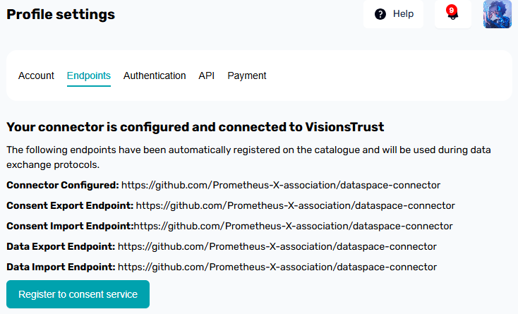
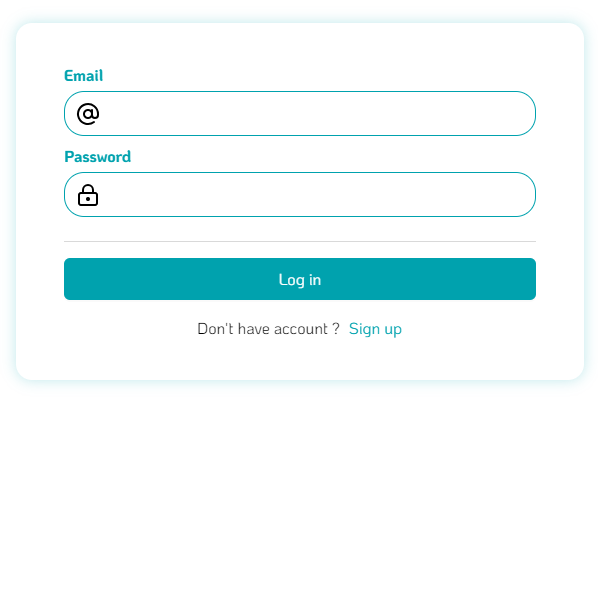
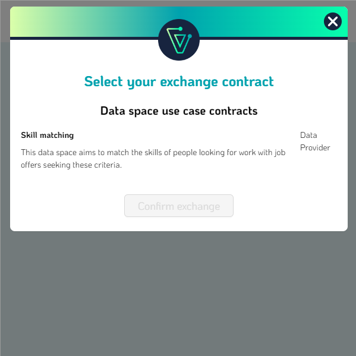
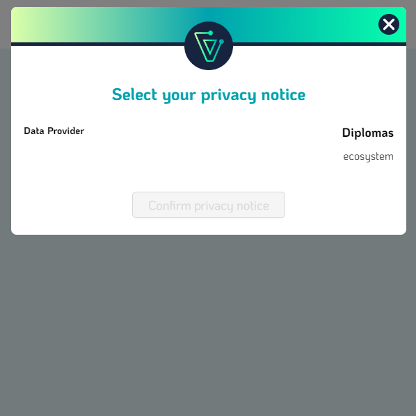
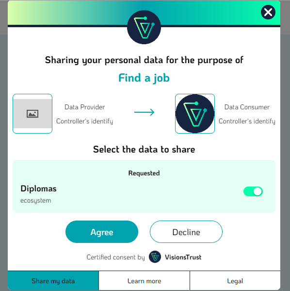
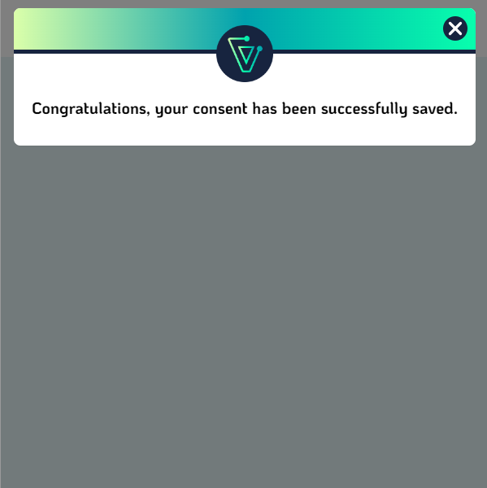
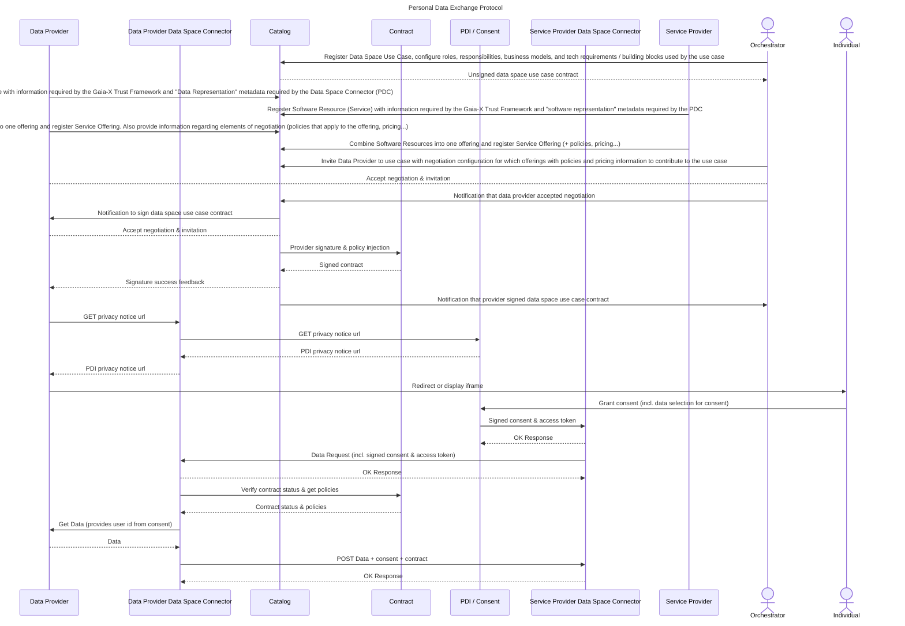

# Integrating Consent

In the data space, if you are a **data provider** or **service provider** running an application on which users connect to and interact with, you might want to propose a direct solution to your users for them to grant their consent for a data exchange through your platform.

The Prometheus-X Dataspace Connector helps you achieve this by providing endpoints that allow you to easily retrieve urls for consent grant that you can either use to redirect the user directly to his PDI, or integrate into your platform as an iframe.

> ⚠ Before attempting any of the operations below, you will need to have configured your Prometheus-X Dataspace Connector and linked it to the VisionsTrust catalog.

## Registering to the Consent Service

For any interaction with the VisionsTrust Consent Service, it needs to be let aware that you are a participant in the dataspace. VisionsTrust allows you to opt-in to the consent service by registering to it through your `endpoints` settings page. 

Assuming you have setup and configured your PDC, the endpoints page will display two elements, the endpoints related to your connector which the catalog will have automatically picked up, and a button to Register to the consent service, as depicted in the image below

All you need to do now is click on the button to opt in and register your information to the consent service. This step will allow you to then authorize the communications between your PDC and the consent service and request consent grant for your users.

## Understanding the Consent Grant process

When an exchange of personal data is needed, the initiator of this data exchange comes from the consent granted by an individual on this specific exchange.

> The `exchange` here implies the data, services & conditions that are defined in the contract between the Data Provider & the Data Consumer / Service Provider.
>
> As a reminder, any kind of consent can only be generated on top of an existing contract between parties of the dataspace. These contracts serve as legal basis for the consent and are tightly coupled with the consents generated.

For security reasons, the authentication of the individual in VisionsTrust's PDI service is mandatory to properly authorize consent grant. This means that VisionsTrust needs to be made aware of your users in order to link the individual's VisionsTrust PDI identity with the identity of that same individual in your user database.

> User registration in consent services is documented in the [Prometheus-X Dataspace Connector wiki](https://github.com/Prometheus-X-association/dataspace-connector/wiki/User-Management), as the connector is probably what you will use to register users.

## Getting Privacy Notices for your users

Privacy notices are the entities that represent what the individual will give his consent on, it represents the necessary information for the individual to know what will happen with his data, what data will be shared, how it will be processed and more on his consent.

The PDC allows you to retrieve privacy notices for your individuals through the connector as documented in the [PDC wiki here](https://github.com/Prometheus-X-association/dataspace-connector/wiki/Personal-Data-Intermediary).

This will allow you to retrieve a URL from the connector that you can use to do one of two things:

| | |
| - | - |
|Redirect the user |Redirecting the user to the provided URL will take him to his PDI, where he will either authenticate if he hasn't already or directly land on the consent screen for the scope of the exchange you requested through the PDC |
| Display in iframe | Displaying the contents of the provided URL in an iframe will allow you to integrate the PDI information directly in your platform, streamlining the user experience.

> Both options lead to the same results but imply a different user experience, it is up to you to define what the best user experience is for your project.

Assuming you did everything right up to this point, here are examples of what your user will see when reaching his PDI or from the iframe

## Full Flow reference

For reference, the whole protocol process for consent driven data exchange is presented here.

    
Full Personal Data Management Flow

```mermaid
sequenceDiagram
    title Personal Data Exchange Protocol

    participant dp as Data Provider
    participant dpdc as Data Provider Data Space Connector
    participant cat as Catalog
    participant con as Contract
    participant pdi as PDI / Consent
    participant dcdc as Service Provider Data Space Connector
    participant dc as Service Provider
    actor oc as Orchestrator
    actor u as Individual

    oc->>cat: Register Data Space Use Case, configure roles, responsibilities, business models, and tech requirements / building blocks used by the use case
    cat-->>oc: Unsigned data space use case contract

    dp->>cat: Register Data Resource with information required by the Gaia-X Trust Framework and "Data Representation" metadata required by the Data Space Connector (PDC)
    dc->>cat: Register Software Resource (Service) with information required by the Gaia-X Trust Framework and "software representation" metadata required by the PDC

    dp->>cat: Combine Data Resources into one offering and register Service Offering. Also provide information regarding elements of negotiation (policies that apply to the offering, pricing...)
    dc->>cat: Combine Software Resources into one offering and register Service Offering (+ policies, pricing...)

    oc->>cat: Invite Data Provider to use case with negotiation configuration for which offerings with policies and pricing information to contribute to the use case
    dp-->oc: Accept negotiation & invitation
    oc->>cat: Notification that data provider accepted negotiation
    cat->>dp: Notification to sign data space use case contract
    dp-->cat: Accept negotiation & invitation
    cat->>con: Provider signature & policy injection
    con-->>cat: Signed contract
    cat-->>dp: Signature success feedback
    cat->>oc: Notification that provider signed data space use case contract

    dp->>dpdc: GET privacy notice url
    dpdc->>pdi: GET privacy notice url
    pdi-->>dpdc: PDI privacy notice url
    dpdc-->>dp: PDI privacy notice url
    dp->>u: Redirect or display iframe
    u->>pdi: Grant consent (incl. data selection for consent)
    pdi->>dcdc: Signed consent & access token
    dcdc-->>pdi: OK Response
    dcdc->>dpdc: Data Request (incl. signed consent & access token)
    dpdc-->>dcdc: OK Response
    dpdc->>con: Verify contract status & get policies
    con-->>dpdc: Contract status & policies
    dpdc->>dp: Get Data (provides user id from consent)
    dp-->>dpdc: Data
    dpdc->>dcdc: POST Data + consent + contract
    dcdc-->>dpdc: OK Response
```

