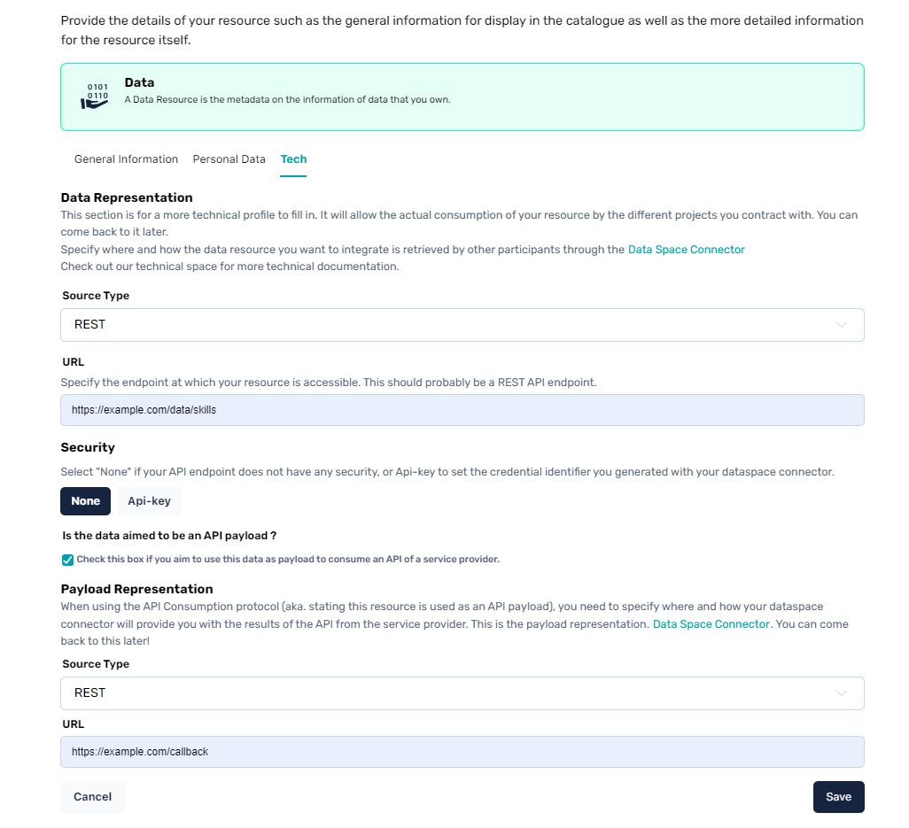
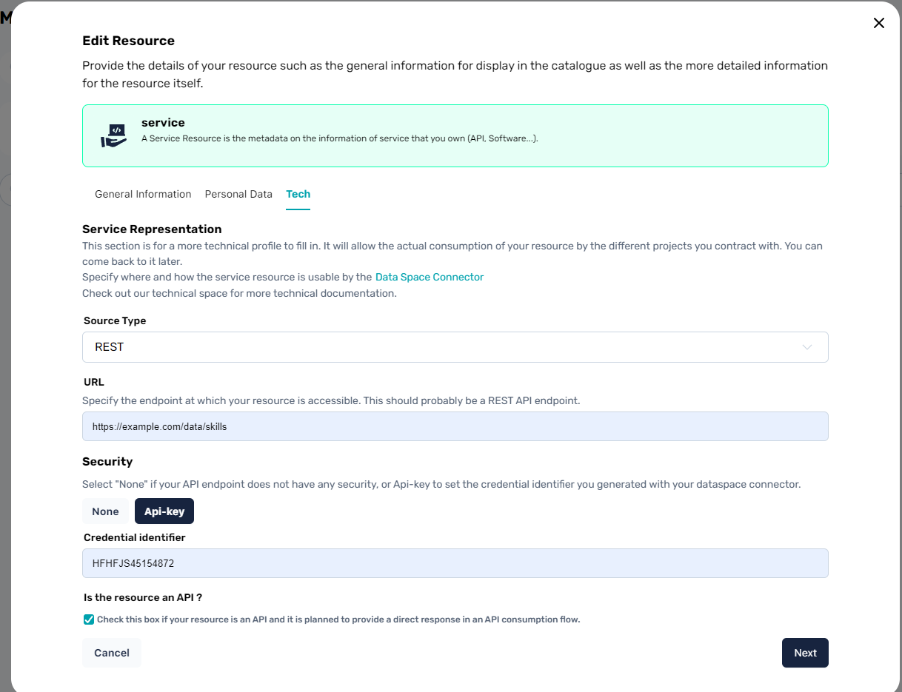

# Setting up resources for technical interaction

For a resource to become available in a data exchange, there are some technical information to be setup on the metadata of that resource in the catalogue. Chances are that if a less-technical profile has created your resources, this information might be missing.

## Representations

Representations for data & services are technical pieces of information that link the metadata of your resource with the technical requirements of the Dataspace Connector.

If they are not set, the PDC will not know how to communicate with your resource during a data exchange protocol and the data exchange will not be able to take place.

## Adding a Data Representation to a Data Resource

In order to add a Data Representation to a Data Resource, meaning, setting all the technical related information on the resource, you can edit an existing resource and navigate to the *Tech* tab.

Here's what you should see

There are 2 different data representations on the image above:

### Data Representation

The first one is the standard data representation

| Field | Description |
| -------- | -------- |
| Source Type | What kind of protocol should be used by the connector to interact with your data resource. This should usually be the protocol used by an API endpoint that outputs data. Currently, the PDC only handles HTTP REST source types. |
| URL | The actual endpoint at which to gather the data as in, what endpoint should it call to get that resource during a data exchange. |
|Security|If set to none, this means that no security is needed from the PDC to communicate with your endpoint. If API-Key is selected, it is expected for you to place a [credential identifier](https://github.com/Prometheus-X-association/dataspace-connector/blob/main/docs/CREDENTIALS.md) generated from your PDC so that your PDC knows what credential value to use at runtime when communicating with your endpoint.|

> *Note about personal data: If your data resource is tagged to concern personal data, it is expected that you fill in the string `{userId}` in your endpoint so it can dynamically be replaced by the PDC during the data exchange process and get the resource for the appropriate user.*

### Payload Representation

The payload representation is used only if your data resource is meant to be an API payload to consume a specific API from a service provider. 

This second representation will be used when the API returns data and serves as a way for your PDC to differentiate the initial resource location (payload to send) and the where to store / send the payload received as a response from the API.

This flow is defined in [this section](./api-consumption-flow.md).

## Adding a Software Representation to a Service Resource

In order to add a Software Representation to a Software Resource, meaning, setting all the technical related information on the resource, you can edit an existing resource and navigate to the *Tech* tab.

Here's what you should see

The actions here to set up your representation are **exactly** the same as those defined in the [data representation](#data-representation).

> You'll notice that on service resources, there is only 1 representation. The checkbox at the bottom enables the API consumption for that service but does not require you to setup any additionnal representation as it can simply use the one defined above.
