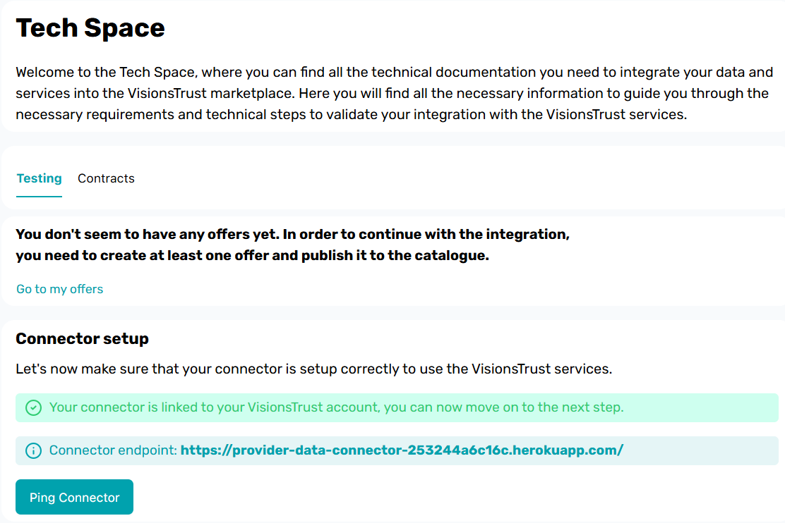
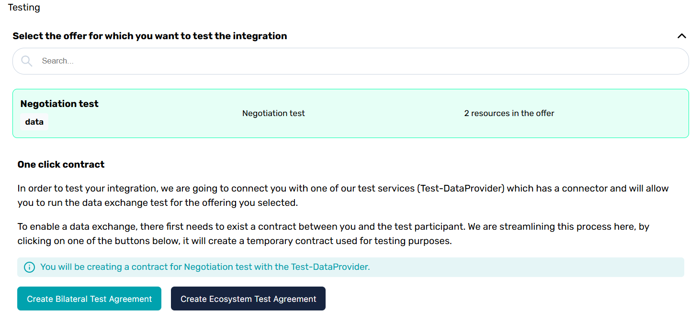
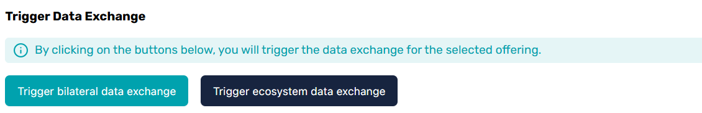

# Testing

The VisionsTrust application provides you with a [Tech Space](https://visionstrust.com/dashboard/tech) that allows you to do several verifications and tests on your setup.

## Verifying the connector setup

One of the first aspects you will be able to test and verify is if your PDC is properly connected to the catalogue.

> Above is an example of what you should see if your PDC is properly set up.

If you want to make sure things are functional, you can awlays hit the "Ping connector" button, which will verify that your connector is properly configured and accessible.

## Running tests

The Tech Space also allows you to run simulation tests with services maintained by Visions.

The prerequisites for this are:

- Having a PDC properly configured
- Having at least one published offer

### Testing

When testing, you will be prompted to select a published offer to use for the testing process.

This offer will need to be set in a contract that the tech space will automatically create for you when clicking on one of the two buttons for contract generation.

> As a recommendation and because it is what is used in most cases, we encourage you to run the test with an project contract (Ecosystem Test Agreement).

Once the contract is created, you will be able to trigger the test data exchange process which will simulate an exchange between your service and the appropriate Visions Test service.

### Notes

We strongly encourage you to use **Test Data** when running this test. Although none of the VisionsTrust ecosystem usually has access to shared data through the protocol, the test service will have brief access to it before deleting it simply to be able to notify you of the success or failure of the test. This is because to properly simulate the full scope of the test, Visions deploys a Test connector which will receive the test data.
