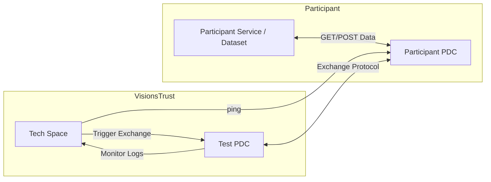
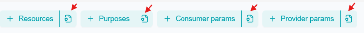

# Tech space

The {{ app_name }} application provides you with a [Tech Space](https://{{ app_name }}.com/dashboard/tech) that allows you to run several verifications and tests on your setup.

## Overview

The Tech Space is a dedicated section within VisionsTrust to allow participants to test their PDC integrations and offer configuration with a test PDC instance. Tests happen in a controlled VisionsTrust environment using VisionsTrust maintained test PDC's simulating data providers or service providers depending on the test to run.

## Use Cases

The tech space is designed to facilitate the test of the following use cases:

- **PDC Integration Testing**: Participants can test the connection of their PDCs to the test instance to ensure compatibility and functionality.
- **Data Exchange Simulation**: The tech space allows for the simulation of data exchanges between PDCs under different scenarios.

## How It Works

The Tech Space has been designed to mimic a real-world environment where PDCs interact with each other.
Participants can select real offers, select the wanted exchange flow, and initiate data exchanges.
The test PDC instance will handle these exchanges, allowing users to observe the behavior of their configurations and make necessary adjustments.

## Requirements

### Connector setup

To use the Tech Space, participants need to set up their PDCs, the following message will be displayed if the PDC is not configured or misconfigured.

!!! tip
    
    Refer to [Setting up a connector](./setting-up-a-connector.md) to ensure proper configuration of your PDC.

Once a connector is set up, the Tech Space dashboard will display the connector information and allow users to ping it.

By clicking on the "Ping Connector" button, Visionstrust will attempt to reach the participant's PDC and display the result of the operation.

When the connector is successfully pinged, users can proceed to create resources and initiate exchanges.

### Exchanges

The tech Space allow user to test 4 types of exchanges:

- **Project Exchange**: 1-to-1 exchange authorized by a contract
- **Service Chain Exchange**: Ephemeral service chain test with test PDCs
- **API Consumption Exchange**: [API consumption PDC protocol](https://github.com/Prometheus-X-association/dataspace-connector/wiki/Data-Exchange#api-consumption-protocol) testing
- **Consent Driven Exchange**: Personal data exchange through consent grant simulation

To initiate an exchange, navigate to the "Exchanges" section of the Tech Space dashboard and select the desired exchange type.
From there, you can choose the offer you want to test, configure the exchange parameters, and start the exchange.

### Custom parameters

The custom params section allows you to define the parameters of an exchange if your exchange involves the need of parameters.
The interface is designed to help you understand what parameters can be used during the exchange along with the format.
By clicking on the button on each param, a payload will be displayed.

!!! info

    Some information in the payload is pre-filled, such as the resource urls. The parameters are then presented as examples but should correlate with the available parameters on your specific offer configuration.

    To know more about parameters, please refer to the dedicated [parameters documentation](https://github.com/Prometheus-X-association/dataspace-connector/wiki/Query-Parameters) of the PDCs Wiki.

### Documentation buttons

The documentation buttons redirect to the corresponding GitHub documentation, including detailed explanations on how to apply query parameters to a specific resource.

### Log Viewer

The Log Viewer is a tool within the Tech Space that allows you to monitor the logs generated during data exchanges. The monitoring is enabled by polling information at a regular interval from the `/dataexchanges` endpoint of the test PDCs which you can monitor from your PDC as well since these are synchronized across PDCs realizing an exchange.

### Downloading logs

The interface proposes a "Download" button allowing you to export all logs as a CSV file. This can be easily shared with the VisionsTrust team if support or troubleshooting is needed.

## Configuration Guides

### Configuring your offers

When an offer is not properly configured, it can't be selected for a test exchange. You can configure it correctly by clicking in the “Configure” button in the error message

This will redirect you to the offer settings page. From here, click on the Edit button in the resource to open the resource edition modal and access the configuration. See [The secrion on resources for an overview on configuration](../application/registering-resources/data-resources.md).

Below is a table of offers available for testing based on the Test Scenario.

| Test Scenario  | Offer Type | Has Personal Data | Usable |
| -------- | -------- | ---- | ---- |
| Project Exchange | Data | No | ✅ |
| Project Exchange | Service | No | ✅ |
| Project Exchange | Data | Yes | ❌ |
| Project Exchange | Service | Yes | ❌ |
| Service Chain | Data | No | ✅ |
| Service Chain | Service | No | ✅ |
| Service Chain | Infrastructure | N/A | ✅ |
| Service Chain | Data | Yes | ❌ |
| Service Chain | Service | Yes | ❌ |
| API Consumption | Data | No | ✅ |
| API Consumption | Service | No | ✅ |
| Consent Driven | Data | Yes | ✅ |
| Consent Driven  | Service | Yes | ✅ |
| Consent Driven | Data | No | ❌ |
| Consent Driven  | Service | No | ❌ |

### Fixing Offer Configuration Errors

**Error: *"This offer does not have a technical configuration and can't be selected for data exchange: Required fields missing"***

From the configuration modal of your resource, navigate to the Data Representation section. From here:
1. Choose the Source Type on REST
2. Specify the endpoint URL at which your resource is accessible
3. Save the configuration

**Error: "This offer does not have an API consumption flow and can't be selected for data exchange; Required fields missing"**
 
If it is a “service offer”, you need to check this box in the configuration page of the resource:

If it is a data offer, you need to:

1. Check the box if you aim to use this data as payload
2. Choose the Source Type on REST
3. Specify the endpoint URL at which your resource is accessible
4. Save the configuration

**Error: "This offer does not include PII and can't be selected for data exchange with PII"**

In the Resource Edition modal you need to:

1. Navigate to the Personal Data tab and check the box “This dataset includes personal data”

2. Ensure you have a {userId} or similar query parameter in your resource URL which allows the PDC to replace this value at runtime with the ID of your user involved in the consent-driven data exchange.
3. Save the configuration

## Flow Guides

Some exchange flows require additional steps beyond offer selection and parameter configuration.

The following guides provide detailed instructions for these flows.

### Service chain Exchange

When attempting to launch a service chain test exchange, the Tech Space displays a Service Chain Example diagram, showing each node involved in the chain. This diagram helps understand which participants are involved and how data moves across the chain.

When testing a Service Offer in the service chain exchange, two service chain flows are available: **SP** and **SPNF**.

**Service Provider – Final Node (SP)**

In this configuration, the service is the final node of the chain and produces the final output of the exchange.

**Service Provider – Non Final Node (SPNF)**

In this configuration, the service acts as an intermediate processing step, allowing additional nodes to follow in the chain.

To select the desired flow, use the toggle control:

* Toggle ON → SP flow
* Toggle OFF → SPNF flow

### Consent-Driven Exchange

Testing consent involves a couple additionnal steps, such as ensuring you have registered a test user through your PDC in the PDI consent service and created an account for that user on the PDI.

The interface guides you through the different steps to take, but here is a recap on what each one will ask of you.

1. Enter the "Email of test user" you want to use for the exchange, then click the "Verify" button.

If no user identifier exists after clicking "Verify email", an error is displayed and you must create one before continuing the consent test exchange. The user creation should be made through the PDC and is explained in the [PDC's wiki documentation](https://github.com/Prometheus-X-association/dataspace-connector/wiki/User-Management).

If a user identifier exists, the PDI account creation interface appears, offering two options: 

* Create Myself
* Create Automatically

### PDI Account creation

#### Create Myself

When selecting "Create Myself", an iframe containing the PDI interface will allow you to manually login or signup a PDI account for the test user. This step is mandatory as the consent grant is triggered from the PDI by the **logged in** user, which ensures authentication for granting consent.

If you've created a PDI account for this user you can simply log in. If not you'll need to provide user registration information and signup by filling out the form.

!!! info

    After the account is created,you need to click “Done” button to display the consent modal. This allows VisionsTrust to know that you've done the external PDI process of account registration.

### Create Account Automatically

Another option is to let VisionsTrust handle user registration for you. This will avoid you having to signup to the PDI and VisionsTrust will provide a generated password for this account for you to use in the next step to login and grant consent.

!!! info

    The password is only displayed once, so please copy it if you intend to use it after testing is over to login to the PDI.

## Notes & Limitations

- As the data in the test exchanges flows through the VisionsTrust controlled test PDCs, we **strongly** encourage you to work with irrelevant test data when running the Test Scenarios.
- The Tech Space is intended for testing purposes only and cannot be used for production data exchanges.
- Certain features available in the production environment may be limited or unavailable in the Tech Space.
