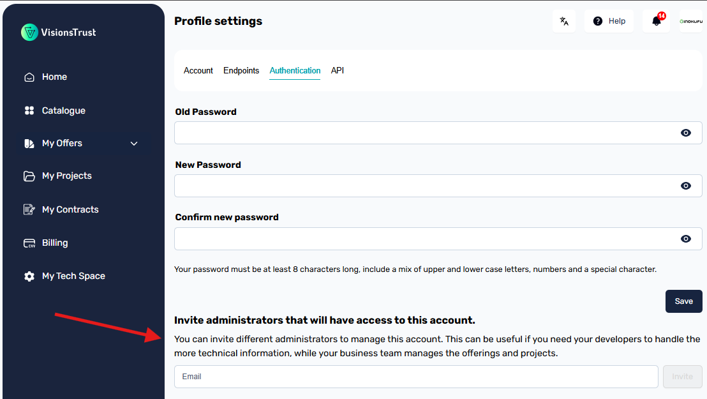

# Admin Access Management

!!! info

    If you're unsure how to access this page, see [how to access your settings](./settings-access.md).

Your account can hold multiple admins that will each be able to log in to the organization with their own email & password. This can be useful if you need to provide credentials to other team members, such as developers for them to input the technical information required in your offer configurations.

Once in your settings, head over to the Authentication tab and you will find a section with a field prompting you to invite admins to your account by providing an email.

Enter the email of your admin and click the "Invite" button. This will automatically generate a password for this user and send it to the provided email. Your admin will be able to handle the rest of the process themselves by following instructions received by email.

!!! warning

    If you are encountering an issue regarding the addition of another admin, please verify that:

    * The admin you wish to add does not already have an organization registered on {{ app_name }}
    * The email you wish to add is not already used by another admin on {{ app_name }}