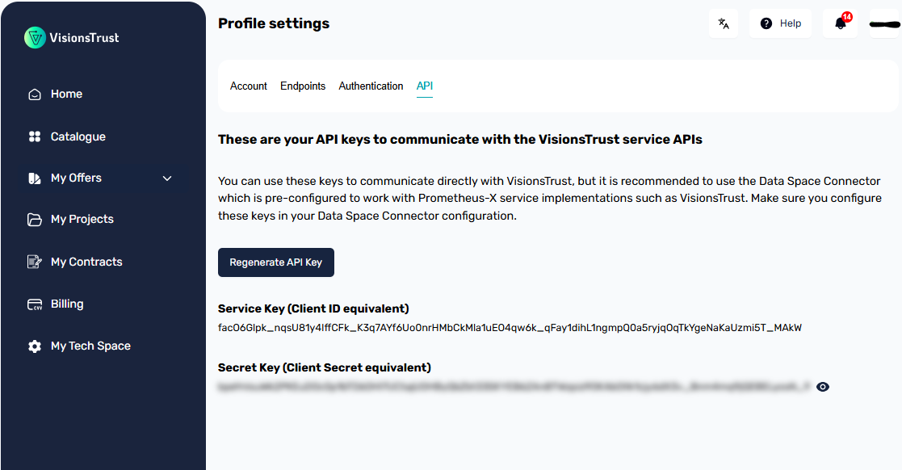

# API Keys

!!! info

    If you're unsure how to access this page, see [how to access your settings](./settings-access.md).

To communicate with VisionsTrust via API or *to allow your PDC to interact with VisionsTrust services*, you will need to grab the API Keys from your settings.

These API Keys are generated when your account is created and can be regenerated at any time.

For configuration in your PDC, you will need to provide these API Keys in the configuration file to ensure your PDC is capable of interacting with VisionsTrust services and authorize data exchanges.

!!! warning

    Keep in mind that if you regenerate your API Keys, you will **need** to update your PDC configuration and reload it to ensure the new API Keys are correctly propagated. Failure to do this will result in all your data exchanges being blocked.