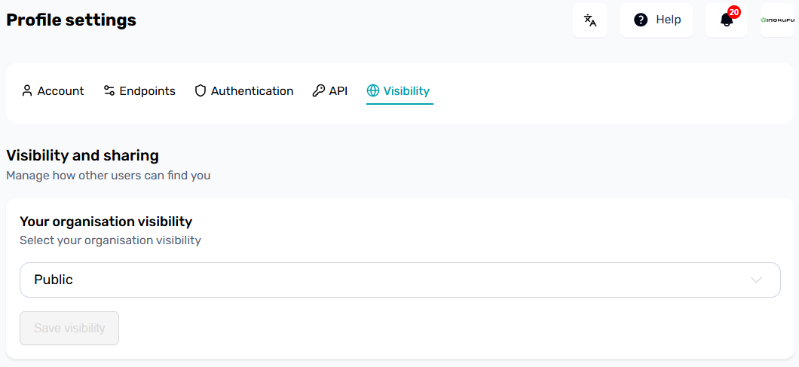
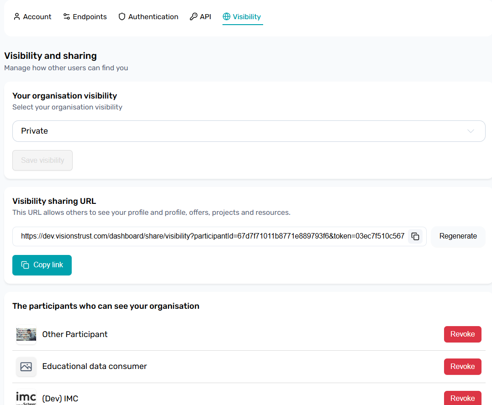
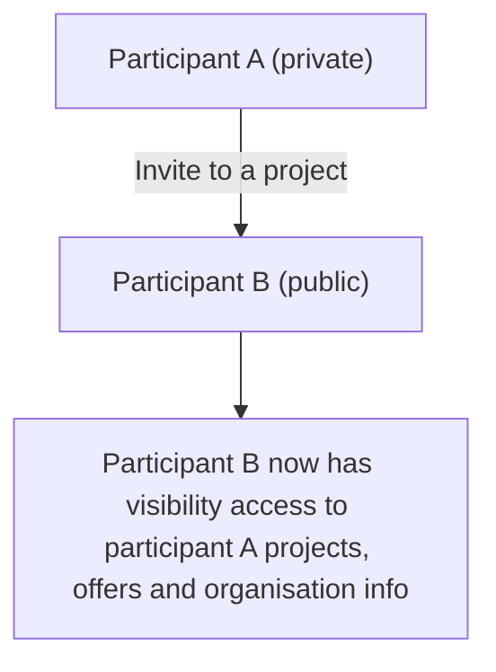

# Visibility and Access Control

{{ app_name }} allows you to control who has visibility on your organisation details as well as the offers and projects you publish. In your settings, you can define your visibility as either **public**, which is the default setting allowing anyone on the catalogue find you and interact with you, or **private** which hides you and all your offers to all other participants in the catalogue except those which you decide to give access to.

!!! info

    The visibility setting affects all of your assets globally, there is no granularity in what you decide to specifically give access to. You can either hide everything or display everything.

## Setting your visibility

In the `visibility` tab of your [settings page](https://{{ app_name }}.com/dashboard/profile/settings), you will find the visibility dropdown menu.

By default this setting will be public when you create your account and allow anyone to find you in the catalogue.



If you change it to private, you will be warned that all of your assets registered on the catalogue (offers, resources and projects) will become hidden from other participants in the catalogue, which will prevent them from interacting with you.



!!! info

    After setting your visibility to private, you will be able to view the organisations that you have given the access to, and will be able to manage these accesses, although constrained to certain rules explained in [the dedicated section](#revoke-conditions).

## Giving access to specific organisations

If you decide to set yourself as **private**, you still have the possibility to invite other organisations to have access to your information.

This action is done through an invitation link that you can share **externally** directly to organisation maintainers that you know for them to redeem in order to get access to your information.

Still in the visibility tab of your settings, you will find an invitation link that you can easily copy and send to anyone. Once this link is consumed by another organisation, they will be able to view your organisation as well as your offers, projects and resources you published to the catalogue.

When a link is redeemed by another organisation, you will receive an in-app notification for it.

### Regenerating the Invitation Link

The Invitation Link can be regenerated at any time, invalidating all previous links generated. This can be useful if the link is not used properly and more organisations than you were expecting are redeeming the link.

!!! info

    In any case, you can always manage and revoke access to organisations at any time from this same page, if the [conditions are met](#revoke-conditions).

## Granting access to project invitations

_This feature is only available to project orchestrators_

Another easier way to grant visibility access to other participants is through [invitations to projects](../application/negotiation/invitations.md). When you invite a participant to a project you lead, it acts as if you had sent an [invitation link](#giving-access-to-specific-organisations) and the other participant had redeemed it automatically.

This enables more fluid UX flows in which you do not need to invite a participant through an invitation link prior to inviting him to your project.

!!! warn

    This is only possible if the other participant is set to a `public` visibility, as you would not be able to find him in the catalogue otherwise.

## Access conditions

Setting your visibility to private comes with a couple caveats that you should be aware of to fully understand the extent of what this setting means.

Below is what it means for other participants once you become `private`.

| Action | Possibility | 
| -------- | -------- |
| Discover your organization in the catalogue | ❌ |
| Discover your data offerings in the catalogue | ❌ |
| Discover your service offerings in the catalogue | ❌ |
| Discover your infrastructure offerings in the catalogue | ❌ |
| Discover your projects in the catalogue | ❌ |
| Request to join a project you lead | ❌ |
| Invite you to join a project they lead | ❌ |
| Generate a data exchange contract with you | ❌ |
| Realise a data exchange with you | ❌ |

!!! info

    As you can see, setting your visibility to private means **cutting off everyone else** from the catalogue, preventing them to any form of interaction with you. Evidently, the participants you directly invite will still have access to all of these actions.

## Revoke Conditions

While revoking access is possible, it is limited to a certain set of restrictions to avoid breaking the lifecycle of other workflows in the platform.

Below is a list of conditions that need to be met in order to enable a revocation of visibility.

| Condition | Why |
| -------- | -------- |
| The other participant **MUST NOT** be in a project you are in | If you and another participant are in a same project, you already have a working contract with this party and access to organisation info and provided offers is controlled through the project |
| You and the other participant **MUST NOT** be in an ongoing contract negotiation | Hiding the visibility before a negotiation is over would break the negotiation flow and prevent viewing information located inside the negotiation |
| You **MUST NOT** have a working contract with the other participant | If there is a contract between you and the other participant, the information is already set in the contract and it would not make sense to hide it away from them |

## Workflows

### Invitations / Visibility Access Grants

<details>
    <summary>Using invitation links</summary>
```mermaid
flowchart TD
    A[Private Participant]-->|Generate Invitation Link|V[{{ app_name }}]
    V-->|Link|A1[Private Participant]
    A1-->|Send invitation Link|B[Other Participant]
    B-->|Redeem invitation Link|V

```
</details>

<details>
    <summary>Inviting through a project invitation</summary>

</details>

### Revocation Condition Checks

<details>
    <summary>Attempt to revoke while participants are in a same project</summary>

```mermaid
graph 
    subgraph Project
    A["Participant A<br>(Project Orchestrator)"]
    B["Participant B<br>(Project Member)"]
    end

    A-->|Tries to revoke access<br>for participant B|VT[{{ app_name }}]
    VT-->END["❌ Prevented: Both participants are in a same project"]
```
</details>

<details>
    <summary>Attempt to revoke access while in a negotiation</summary>

```mermaid
graph
    subgraph Project Negotiation
    A["Participant A<br>(Project Orchestrator)"]
    B["Participant B<br>(Invited Participant)"]
    end

    A-->|Tries to revoke access<br>for participant B|VT[{{ app_name }}]
    VT-->END["❌ Prevented: Participants are in an ongoing negotiation process"]
```
</details>